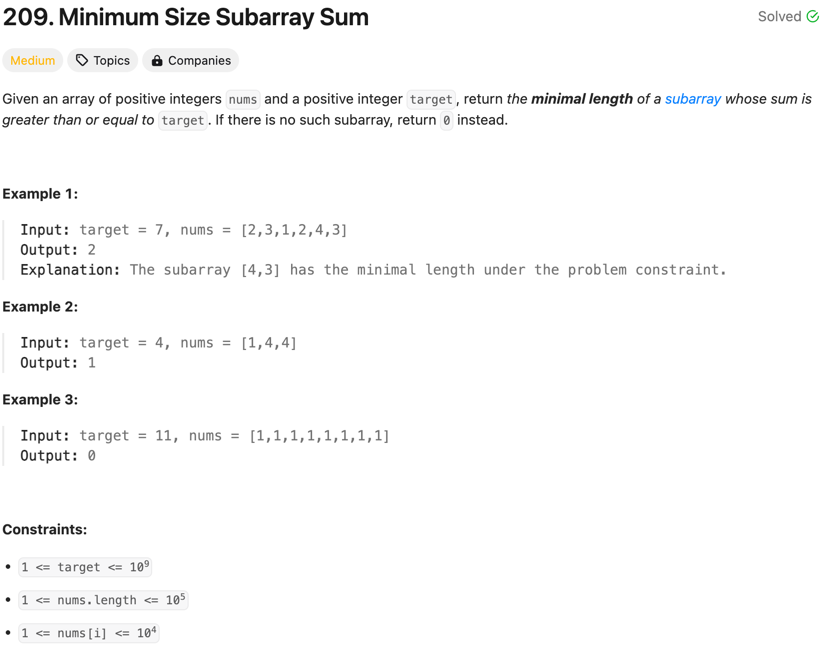
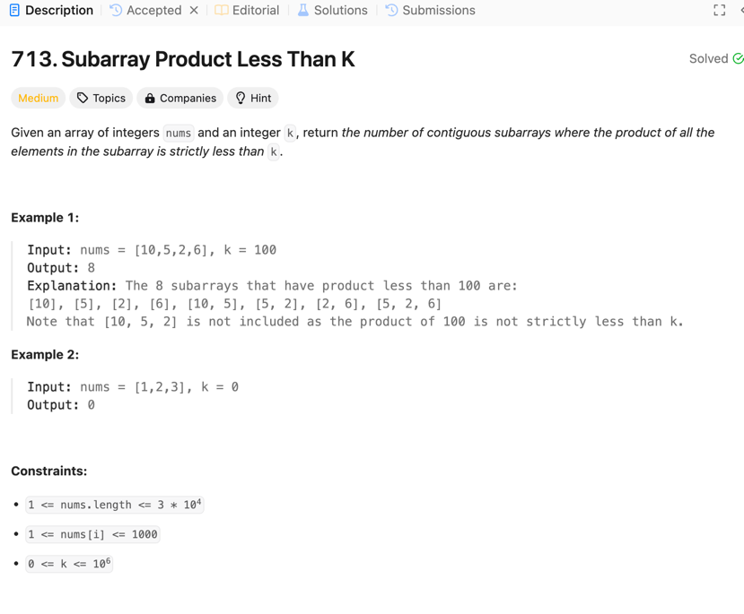
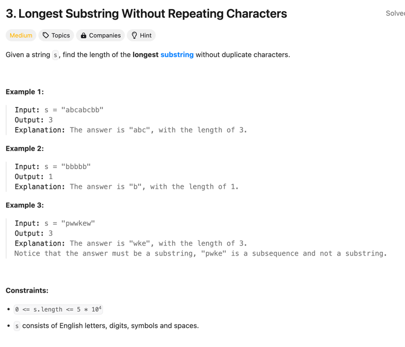

# 滑动窗口
## 在缩小窗口时计算答案
不停增大窗口右指针（增大右指针），不满足条件时候缩小窗口范围（增大左指针）

```java
class Solution {
    public int minSubArrayLen(int target, int[] nums) {
        // Time: O(n) 因为不论left或者right，最左都只能加到n
        // Space: O(1) 只用到了一些变量
        int sum = 0;
        int left = 0;
        int right = 0;
        int result = Integer.MAX_VALUE;

        while (right < nums.length) {
            sum += nums[right];

            while (sum >= target) {
                result = Math.min(result, right - left + 1);
                sum -= nums[left];
                left++;
            }
            right++;
        }

        return result == Integer.MAX_VALUE ? 0 : result;
    }
}
```

## 缩小完窗口计算答案

```java
class Solution {
    public int numSubarrayProductLessThanK(int[] nums, int k) {
        // 因为要求严格小于k，所以k<=1的时候，这样的子数组是不存在的
        if (k <= 1) {
            return 0;
        }

        int result = 0;
        int left = 0;
        int product = 1;
        for (int right = 0; right < nums.length; right++) {
            product *= nums[right];

            // 因为要找的是小于k的窗口，所以计算结果的时候，应该在窗口收缩完，满足条件的时候计算
            while (product >= k) {
                product /= nums[left];
                left++;
            }
            result += right - left + 1;
        }

        return result;
    }
}
```

## 使用map统计次数

```java
class Solution {
    public int lengthOfLongestSubstring(String s) {
        Map<Character, Integer> countMap = new HashMap<>();
        int result = 0;
        int left = 0;

        for (int right = 0; right < s.length(); right++) {
            char ch = s.charAt(right);
            countMap.put(ch, countMap.getOrDefault(ch, 0) + 1);

            // 如果当前字符出现次数大于1了，说明出现重复字符，应该缩小窗口
            while (countMap.get(ch) > 1) {

                // 缩小窗口的时候，要计算的是窗口左边字符的出现次数，不是ch
                char leftCh = s.charAt(left);
                countMap.put(leftCh, countMap.get(leftCh) - 1);
                left++;
            }

            // 走到这里是没有重复字符的，可以计算答案
            result = Math.max(result, right - left + 1);
        }

        return result;
    }
}
```

# 二分查找
## 模板
一开是先写成3条件的，然后根据收缩的方向，把==的case和其他的条件合并。就完全没有bug了

```diff
+   while (left < right) { // 小于
+       int mid = left + (right - left) / 2;
+       if (arr[mid] < target) {
+           left = mid + 1;
        } else {
+           right = mid;
        }
    }
```