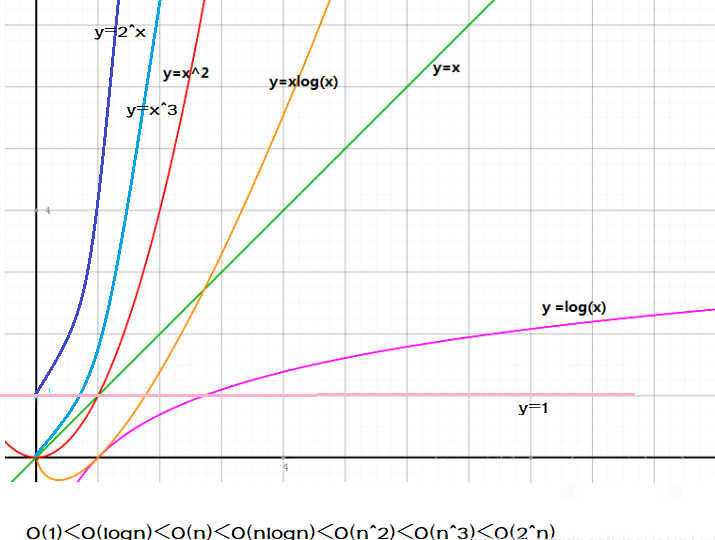

# 集合  
## 概述  
- 定义： 由一个或者多个确定的元素所构成的整体
- 作用： 简化表达，公理化基础
- 特性： 确定性，互异性，无序性
- 空集/子集/交集/并集/幂集

### 幂集  
某个集合的所有子集组成的集合就是幂集  
> eg： A {1, 2, 3}  
子集：{}, {1}, {1,2}, {1,3}, {1,2,3}, {2}, {2,3}, {3}  
幂集: {{}, {1}, {1,2}, {1,3}, {1,2,3}, {2}, {2,3}, {3}}  

> 有限集合的幂集元素个数（也就是子集的数量）= 2 ^ n (n是有限集合中元素的个数)  
eg： A {1, 2, 3}  子集有 2 ^ 3 = 8. 幂集元素个数也是8个

> java中使用set来描述集合，因为无序且不重复  

# 函数  
## 概述  
- 定义： 设集合A，B是非空的数集，如果按照某种确定的对应关系f，使对于集合A中的任意一个数x，在集合B中都有唯一确定的数y与之对应，那么就称映射f：A -> B为集合A到集合B的一个函数
- 函数三要素：定义域，值域，对应法则，y=f(x), x 属于 A
- 特性： 有界性/单调性/奇偶性/周期性/连续性

## 常见函数  
- 常函数： y = a 
- 幂函数： y = ax^b
- 指数函数： y = a^x
- 对数函数： y = logaX (a > 0)

 

# 排列组合  
## 排列  
- 定义： 从n个不同元素中，任取m（m<=n,m n均为自然数）个不同的元素按照一定的顺序排列成一列，叫作从n个不同元素中取出m个元素的一个排列
- 公式： 排列数 = n! / (n - m)!
- 在乎顺序，【1，2，3】和【3，2，1】被看作是两个

## 组合
- 定义： 从n个不同元素中，任取m（m<=n）个元素拼成一组，叫作从n个不同元素中取出m个元素的一个组合。从n个不同元素中取出m（m<=n）个元素的所有组合的个数，叫作从n个不同元素中取出m个元素的组合数。用符号C(n,m)表示
- 公式： 组合数 = n! / m! * (n - m)!
- 只在乎取谁，不在乎顺序，【1，2，3】和【3，2，1】被看作是一个

# 数学归纳法  
## 概述  
- 定义： 一种数学证明方法，通常被用于证明某个给定命题在整个（或者局部）自然数范围内成立
- 步骤
    1. 基础步骤：证明当n=1时，命题成立
    2. 归纳步骤：证明当n=k时，命题成立，推导出在n=k+1时命题也成立

# 数列  
## 概述
- 定义： 一组按顺序排列的书，记为{an}

## 特殊数列  
### 斐波那契数列  
An+2 = An + An+1

### 等差数列： 从第二项其，每一项与他的前一项的差等于一个常数
- 通项公式： An = A1 + (n - 1) * d  (d是公差)
- 前n项和： Sn = n * (A1 + An) / 2

### 等比数列： 从第二项其，每一项与他的前一项的比等于一个常数
- 通项公式： An = An-1*q  (q是公比)
- 前n项和： Sn = A1 *  (1 - q^n) / 1 - q, q != 1 Sn = nA1, q = 1
