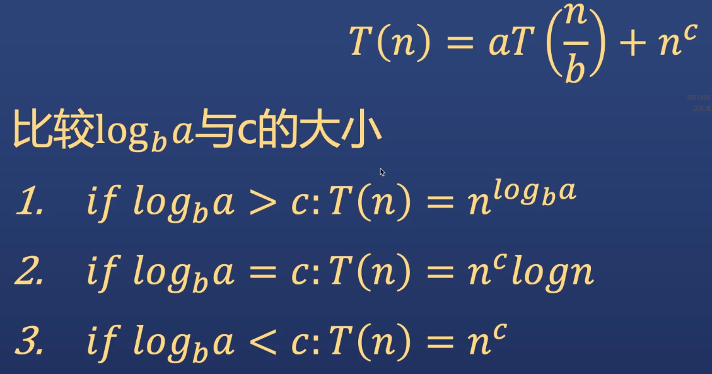
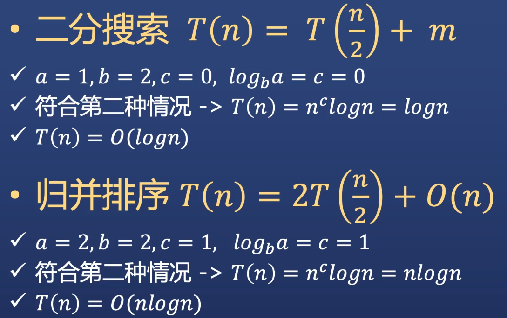

# 算法复杂度

## 时间复杂度  
### 定义
计算机科学中，算法的时间复杂度是一个函数，它定量描述了该算法的运行时间。以算法输入的规模n为自变量的函数：T(n) = O(f(n))

### 复杂度描述符号  
- O （Big O） 不超过某个界限
- Ω （Big Omega） 超过某个界限
-    (Big Theta)  确定是某个界限
- 结论： 使用O来描述即可

### 时间复杂度比较  
O(!n) > O(2^n) > O(n^3) > O(n^2) > O(nlogn) > O(n) > O(logn) > O(1)

## 时间复杂度计算  
### 一般问题  
- 基本操作的时间复杂度
    - 丢弃常数项
    - 丢弃次要项
- 基本操作被执行了多少次（For/While循环）
- 复合操作：加还是乘


```java
/* 基本操作的时间复杂度 */
// 丢弃常数项
O(2n^2) -> O(n^2)
O(5n) -> O(n)
O(50000) -> O(1)

// 丢弃次要项
O(n^2 + n) -> O(n^2)
O(logn + n) -> O(n)
O(5 * 2^n + 1000n^100) -> O(2^n)


/* For/While循环 */
// 执行了多少次，时间复杂度就是多少
for (int i = 0; i < array.length; i++>) {
    print(i);
}

while (i < 10>) {
    print(i);
    i++
}

/* 复合操作：加还是乘 */
// 先做A，完后再做B。则相加  O(A + B)
for (int a : arrA) {
    print(a);
}
for (int b : arrB) {
    print(b);
}

// 每一次做A的时候都需要将B做一遍，则相乘  O(A * B)
for (int a : arrA) {
    for (int b : arrB) {
        print(a + b);
    }
}
```

复杂度计算实战题
```java
// 内层的循环是n次，所以复杂度是O(n)
// 外层的循环条件是i = i * 2，i的增长趋势是1，2，4，8，16，32... 这样看下来i=2^t. 这个t就是i可以循环的次数
// 因为i <= n 即 2^t <= n，对两边取对数的话t <= logn. 即循环的此数是logn，那么复杂度也就是logn
// 然后内外循环相乘，复杂度就是O(n * logn)
int count(int n) {
    int count = 0;
    for (int i = 1; i <= n; i = i * 2) {
        for (int j = 1; j <= n; j++) {
            count++;
        }
    }
    return count;
}

// 两个for循环都是O(n)
// while循环执行的次数是t，k = k * 5执行了t次。k=5^t (1,5,25,125...)
// t=log5k=logn
// 所以最后的时间复杂读O(n * n * logn)
void foo(int n) {
    int i = 1;

    for (int i = 0; i < n; i = i++) {
        for (int j = 0; j <= n; j++) {
            int k = 1;
            while (k <= n) {
                k = k * 5
            }
        }
    }
}
```

# 递归问题时间复杂度  
## 递归定义  
在数学与计算机科学中，是指在函数的定义中使用函数自身的方法。递归一次还较常用于描述以自相似方法重复事物的过程
```java
int calculate(int i) {
    if (n <= 0) {
        return 1;
    }
    return calculate(n - 1) + calculate(n - 1);
}
```

## 一般表达形式
> T<n> = aT(n/b) + f(n)  
- 问题规模是n
- 分解为a个子问题，每个子问题的规模为n/b
- a个子问题递归地求解，求解话费时间为T(n/b)
- f(n)为问题分解和子问题合并的代价  

## 怎么求解递归时间复杂度  
- 求函数表达式
- 递归树
- 主要定理
- 野路子：经验性结论

### 求函数表达式  
- 好处是准确直观，很多时候计算复杂，无法求出
- 常见手段：累加/累乘/迭代/一切数学工具

### 递归树  
- 把递归问题描用书来描述其迭代展开的过程  
- 递归树是一棵节点带权值的树，初始的递归树只有一个节点，他的权标记为T(n);然后按照递归树的迭代规则不断进行迭代，每迭代一次递归树就增加一层，知道树中不再含有权值为函数的节点（即叶节点都为T(1)）
- 在得到递归树后，将树中每层中的代价求和，得到每层代价，然后将所有层的代价求和，得到所有层测的递归调用的总代价

```java
/* 递归树复杂度案例 */
T(n) = 2T(n) + n^2

// 首次拆分
    n^2
    /  \
T(n/2)  T(n/2)

// 第二次拆分
            n^2
          /    \
    (n/2)^2     (n/2)^2
    /  \         /  \
T(n/4) T(n/4) T(n/4)  T(n/4)

// ....

// 拆分知道所有节点都变为O（1）,然后把每层的代价相加(二分之一的k次方 * n方)
            n^2                     n^2
          /      \
    (n/2)^2     (n/2)^2             n^2/4 + n^2/4 = n^2/2
    /  \         /      \
(n/4)^2 (n/4)^2 (n/4)^2  (n/4)^2    4 * n^2 /16  = n^2/4
....
O(1)O(1)O(1)O(1)O(1)O(1)O(1)O(1)    n^2/2^k

// 现在的问题就是求出层数，就能知道最后的代价. 现在看到代价的增长是这样的，用极限思维可知分数最后相加一定趋于一个常数，所以最后的复杂度就是n^2
1 1/2 1/4 1/8....
O(n^2)
```

### 主定理  
子问题规模不一样的时不能用




### 野路子： 经验性结论  
递归问题的时间复杂度通常（并不总是）看起来形如O(branches^depth)
其中branches指递归分支的总数，depth指递归调用深度。

