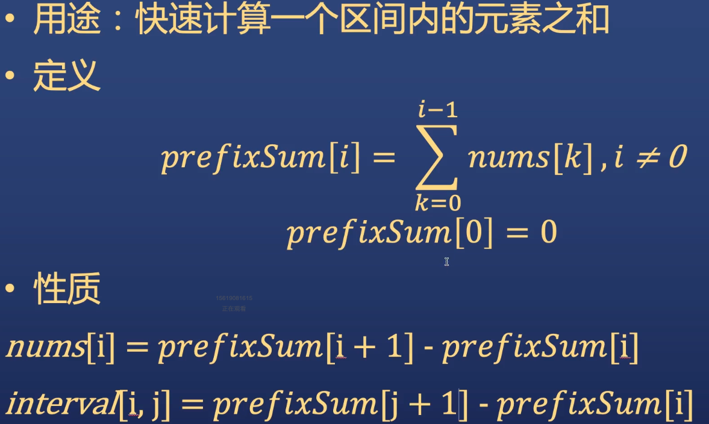

# 1 数组问题
## 1.1 拿到数组题目应确认的点
1. 什么类型数组 int char？ 正整数，整数？
2. 有无重复元素
3. 是否有序
4. 要求的输出是什么？ 全部结果/任意结果
5. 函数定义
    - 输入参数（几个，什么类型）
    - 输出/返回值
    - 名字（长没事，要具体）
6. 检查input（null）


## 1.2 两数之和
[1. 两数之和](https://leetcode.cn/problems/two-sum/)
### brute force  

因为使用了双重循环，时间复杂度是O(n^2)
```java
class Solution {
    public int[] twoSum(int[] nums, int target) {
        if (nums == null || nums.length < 2) {
            return new int[2];
        }
        int[] result = new int[2];
        for (int i = 0; i < nums.length - 1; i++) {
            for (int j = i + 1; j < nums.length; j++) {
                if (nums[i] + nums[j] == target) {
                    result[0] = i;
                    result[1] = j;
                    return result;
                }
            }
        }
        return result;
    }
}
```
### 排序+双指针  

类库的排序算法复杂度是O(nlogn),双指针是O(n)。所以总体复杂度是O(nlogn)
```java
class Solution {
    public int[] twoSum(int[] nums, int target) {
        if (nums == null || nums.length < 2) {
            return new int[2];
        }
        int[] result = new int[2];
        Arrays.sort(nums);

        int left = 0;
        int right = nums.length - 1;
        while (left < right) {
            if (nums[left] + nums[right] < target) {
                left++;
            } else if (nums[left] + nums[right] > target) {
                right--;
            } else {
                result[0] = left;
                result[1] = right;
                return result;
            }
        }
        return result;
    }
}
```


## 1.3 三数之和

[15. 三数之和](https://leetcode.cn/problems/3sum/)
## brute force  

三重循环，复杂度是O(n^3)
```java
public class Solution {
    
    public int[] threeSum(int[] nums, int target) {
        int[] result = new int[3];
        if (nums.length < 3) {
            return result;
        }

        for (int i = 0; i < nums.length - 2; i++) {
            for (int j = i + 1; j < nums.length -1; j++) {
                for (int k = j + 1; k < nums.length; k++) {
                    if (nums[i] + nums[j] + nums[k] == target) {
                        result[0] = nums[i];
                        result[1] = nums[j];
                        result[2] = nums[k];
                        return result;
                    }
                }
            }
        }
        return result;
    }

}
```

### 排序+遍历+双指针

排序算法复杂度是O(nlogn), 因为进行了两次循环，所以复杂度是O(n^2),最后的复杂度就是O(n^2)
```java
public class Solution {
    
    public int[] threeSum(int[] nums, int target) {
        int[] result = new int[3];
        if (nums.length < 3) {
            return result;
        }

        Arrays.sort(nums);
        for (int i = 0; i < nums.length - 2; i++) {
            int first = i + 1;
            int second = nums.length - 1;
            int newTarget = target - nums[i];

            while (first < second) {
                if (nums[first] + nums[second] == newTarget) {
                    result[0] = nums[i];
                    result[1] = nums[first];
                    result[2] = nums[second];
                    return result;
                }

                if (nums[first] + nums[second] > newTarget) {
                    seond--;
                }
                if (nums[first] + nums[second] < newTarget) {
                    first++;
                }
            }
        }
        return result;
    }

}
```


## 1.4 四数之和  

[18. 四数之和](https://leetcode.cn/problems/4sum/)
## 排序+双指针
排序算法复杂度是O(nlogn), 因为进行了3次循环，所以复杂度是O(n^3),最后的复杂度就是O(n^3)

```java
class Solution {
    public List<List<Integer>> fourSum(int[] nums, int target) {
        List<List<Integer>> result = new ArrayList<>();
        if (nums == null || nums.length < 4) {
            return result;
        }

        Arrays.sort(nums);

        for (int i = 0; i < nums.length - 3; i++) {
            if (i > 0 && nums[i] == nums[i - 1]) {
                continue;
            }

            for (int j = i + 1; j < nums.length - 2; j++) {
                if (j > i + 1 && nums[j] == nums[j - 1]) {
                    continue;
                }

                int start = j + 1;
                int end = nums.length - 1;

                while (start < end) {
                    long sum = (long)nums[i] + (long)nums[j] + (long)nums[start] + (long)nums[end];

                    if (sum == target) {
                        List<Integer> fourElementList = new ArrayList<>();
                        fourElementList.add(nums[i]);
                        fourElementList.add(nums[j]);
                        fourElementList.add(nums[start]);
                        fourElementList.add(nums[end]);
                        result.add(fourElementList);

                        // 去重 left -> right
                        while (start < end && nums[start] == nums[start + 1]) {
                            start++;
                        }
                        start++;

                        // 去重 right <- left
                        while (start < end && nums[end] == nums[end - 1]) {
                            end--;
                        }
                        end--;
                    } else if (sum < target) {
                        start++;
                    } else {
                        end--;
                    }
                }
            }
        }
        return result;
    }
}
```

## 1.5 K-sum解法总结  
- 排序
- 尝试遍历第一个数，将问题转化为k-1Sum
- 时间复杂度  
> 2-Sum: O(nlogn) + O(n) = O(nlogn)  
> 3-Sum: O(nlogn) + O(n^2) = O(n^2)  
> 4-Sum: O(nlogn) + O(n^3) = O(n^3)  
> k-Sum: O(nlogn) + O(n^(k-1)) = O(n^(k-1))  

# 2 实战题目  

## 2.1 反转字符数组
[344. 反转字符串](https://leetcode.cn/problems/reverse-string/)

### 双指针
Time: O(n)
```java
class Solution {
    public void reverseString(char[] s) {
        if (s == null || s.length == 1) {
            return;
        }

        int left = 0;
        int right = s.length - 1;

        while (left < right) {
            char c = s[left];
            s[left] = s[right];
            s[right] = c;
            left++;
            right--;
        }
    }
}
```


## 2.2 奇偶排序

[905. 按奇偶排序数组](https://leetcode.cn/problems/sort-array-by-parity/)
### 双指针
Time: O(n)

```java
class Solution {
    public int[] sortArrayByParity(int[] nums) {
        if (nums == null || nums.length <= 1) {
            return nums;
        }

        int left = 0;
        int right = nums.length - 1;

        while (left < right) {
            while (left < right && nums[left] % 2 == 0) {
                left++;
            }

            while (left < right && nums[right] % 2 != 0) {
                right--;
            }

            int temp = nums[left];
            nums[left] = nums[right];
            nums[right] = temp;
        }
        return nums;
    }
}
```

## 2.3 合并两个有序数组
[88. 合并两个有序数组](https://leetcode.cn/problems/merge-sorted-array/)

### 双指针
Time: O(n)

```java
class Solution {
    public void merge(int[] nums1, int m, int[] nums2, int n) {
        int[] result = new int[m + n];

        int index = 0;
        int index1 = 0;
        int index2 = 0;

        // 把两个数组中的数据先保存到一个临时数组
        while (index1 < m && index2 < n) {
            if (nums1[index1] <= nums2[index2]) {
                result[index++] = nums1[index1++];
            } else {
                result[index++] = nums2[index2++];
            }
        }
        
        // 没有被遍历的元素也放到临时数组里面
        while (index1 < m) {
            result[index++] = nums1[index1++];
        }
        while (index2 < n) {
            result[index++] = nums2[index2++];
        }

        // 用临时数组填充nums1
        for (int i = 0; i < nums1.length; i++) {
            nums1[i] = result[i];
        }
    }
}
```

## 2.4 前缀和  

### 途中的i，j指的都是下标


### 前缀和模版代码  
```java
// 1. 前缀和数组的长度为原来数组的长度+1
// 2. 注意构造时index的取值范围
int[] prefixSum = new int[num.length + 1];
for (int i = 0; i < num.length; i++) {
    prefixSum[i + 1] = prefixSum[i] + num[i];
}

/*
nums:   1  2  3  4  
prefix: 0  1  3  6  10

nums[2] = prefix[3] - prefix[2] = 3
interval[2, 3] = prefix[4] - prefix[2] = 7

interval[2, 3] 指的是原数组的索引
*/
```

### 前缀和练习  
[303. 区域和检索 - 数组不可变](https://leetcode.cn/problems/range-sum-query-immutable/)

```java
 class NumArray {

    private int[] prefixSum;

    public NumArray(int[] nums) {
        prefixSum = new int[nums.length + 1];
        for (int i = 0; i < nums.length; i++) {
            prefixSum[i + 1] = prefixSum[i] + nums[i];
        }
    }
    
    // 这里返回的时候是O(1)复杂度
    public int sumRange(int left, int right) {
        return prefixSum[right + 1] - prefixSum[left];
    }
}
```

### 数组动态和
[1480. 一维数组的动态和](https://leetcode.cn/problems/running-sum-of-1d-array/)

Time/Space: O(n)
```java
class Solution {
    public int[] runningSum(int[] nums) {
        if (nums == null || nums.length == 0) {
            return null;
        }

        int[] prefixSum = new int[nums.length];
        for (int i = 0; i < nums.length; i++) {
            if (i == 0) {
                prefixSum[i] = nums[i];
            } else {
                prefixSum[i] = prefixSum[i - 1] + nums[i];
            }
        }

        return prefixSum;
    }
}
```