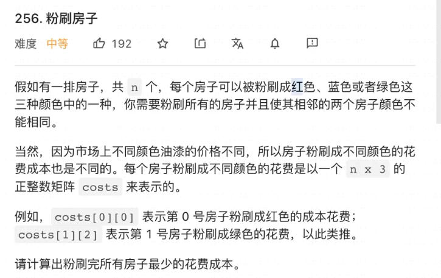
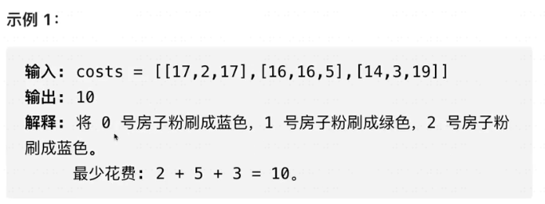
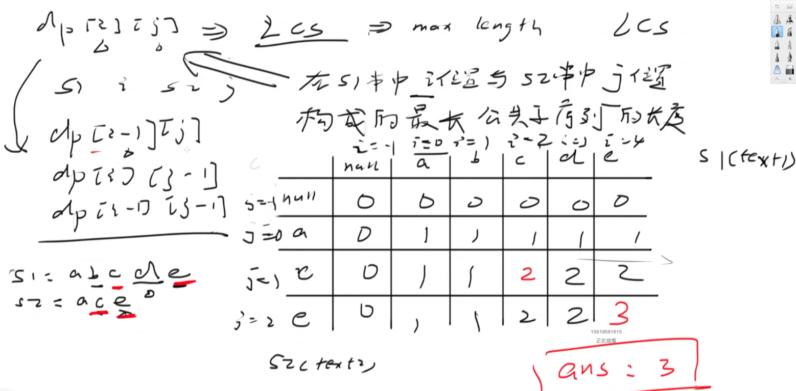

# 1. 王者难度算法-动态规划

## 1.1 什么是动态规划

就是for/递归 + 记忆化搜索


## 1.2 四个步骤设计动态规划

- 定义状态（State）：刻画一个最优解的结构特征
- 定义状态转移方程（Function）：状态之间的联系与状态转移【核心难点】
- 初始条件与边界条件（Condition）：基本条件是什么，最小状态是什么. 初始化第0个元素（数组的话填充最大/小值）
- 最优解求解（Solution）


## 1.3 什么时候可以使用动态规划

- 最优子结构性质：一个问题的最优解包含其子问题的最优解
- 子问题的重叠性：问题的递归算法会反复求解相同的子问题，而不是一只生成新的子问题
- 无后效性：对一个确定的状态，不必关心这个状态是怎么出现的，也不必考虑这个状态的前一个状态是什么


### 通常用于最优化问题

- 求方案总数
- 方案可行性
- 求最优化解
- DP不适合输出所有可行方案的题目


# 2. 实战

## 2.1 单序列动态规划：斐波那契系列

### 爬楼梯

[70. 爬楼梯](https://leetcode.cn/problems/climbing-stairs/)

用dp数组

```java
class Solution {
    public int climbStairs(int n) {
        if (n == 0) {
            return 0;
        }

        // dp[n]: 有多少中不同的方法爬到第n阶
        int[] dp = new int[n + 1];  // 为了不用倒腾索引的关系，最后直接返回dp[n]
        dp[0] = 1;
        dp[1] = 1;

        for (int i = 2; i <= n; i++) {
            // 状态转移方程：dp[n] = 最后一步爬1个台阶的方案总数（dp[n - 1]） + 最后一步爬2个台阶的方案总数（dp[n - 2]）
            dp[i] = dp[i - 1] + dp[i - 2];
        }

        return dp[n];
    }
}
```

滚动数组优化

```java
class Solution {
    public int climbStairs(int n) {
        if (n == 0) {
            return 0;
        }

        // dp[n]: 有多少中不同的方法爬到第n阶
        int[] dp = new int[2];  // 为了不用倒腾索引的关系，最后直接返回dp[n]
        dp[0] = 1;
        dp[1] = 1;

        for (int i = 2; i <= n; i++) {
            // 状态转移方程：dp[n] = 最后一步爬1个台阶的方案总数（dp[n - 1]） + 最后一步爬2个台阶的方案总数（dp[n - 2]）
            dp[i % 2] = dp[(i - 1) % 2] + dp[(i - 2) % 2];
        }

        return dp[n % 2];
    }
}
```

用两个数字

```java
class Solution {
    public int climbStairs(int n) {
        if (n == 0) {
            return 0;
        }

        // dp[n]: 有多少中不同的方法爬到第n阶
        int pre = 1, cur = 1, sum = 0;

        for (int i = 2; i <= n; i++) {
            // 状态转移方程：dp[n] = 最后一步爬1个台阶的方案总数（dp[n - 1]） + 最后一步爬2个台阶的方案总数（dp[n - 2]）
            sum = pre + cur;
            pre = cur;
            cur = sum;
        }

        return cur;
    }
}
```


### 第 N 个泰波那契数

[1137. 第 N 个泰波那契数](https://leetcode.cn/problems/n-th-tribonacci-number/)

```java
class Solution {
    public int tribonacci(int n) {
        if (n == 0) {
            return 0;
        }

        if (n == 1 || n == 2) {
            return 1;
        }

        int[] dp = new int[3];
        dp[0] = 0;
        dp[1] = 1;
        dp[2] = 1;
        for (int i = 3; i <= n; i++) {
            dp[i % 3] = dp[(i - 3) % 3] + dp[(i - 2) % 3] + dp[(i - 1) % 3];
        }

        return dp[n % 3];
    }
}
```


### 使用最小花费爬楼梯

[746. 使用最小花费爬楼梯](https://leetcode.cn/problems/min-cost-climbing-stairs/)

```java
class Solution {
    public int minCostClimbingStairs(int[] cost) {
        // 题意解释：到达楼梯顶部是要走完整个cost，要超出cost数组最后一个元素才算走完
        if (cost == null || cost.length == 0) {
            return 0;
        }

        // State: dp[n]:到达第n级阶梯所需要的最小花费
        int[] dp = new int[2];
        
        // 因为 你可以选择从下标为 0 或下标为 1 的台阶开始爬楼梯。 -》 说明0和1级阶梯的话是不用花费的，初始为0即可
        dp[0] = 0;
        dp[1] = 0;

        int n = cost.length;
        for (int i = 2; i <= n; i++) {
            // Function: dp[i] = min(dp[i - 1] + cost[i - 1], dp[i - 2] + cost[i - 2])
            dp[i % 2] = Math.min(dp[(i - 1) % 2] + cost[i - 1], dp[(i - 2) % 2] + cost[i - 2]);
        }

        // Solution: dp[n % 2].  因为n是超过了cost的索引，是最终的结果
        return dp[n % 2];
    }
}
```


## 2.2 单序列动态规划：打家劫舍系列

### 打家劫舍

[198. 打家劫舍](https://leetcode.cn/problems/house-robber/)

普通dp

```java
class Solution {
    public int rob(int[] nums) {
        if (nums == null || nums.length == 0) {
            return 0;
        }

        // dp多一个单位来计算，为了防止空指针之类的问题
        int[] dp = new int[nums.length + 1];
        dp[0] = 0;
        dp[1] = nums[0];

        for (int i = 2; i < dp.length; i++) {
            dp[i] = Math.max(dp[i - 2] + nums[i - 1], dp[i - 1]);
        }
        return dp[nums.length];
    }
}
```

滚动数组

```java
class Solution {
    public int rob(int[] nums) {
        if (nums == null || nums.length == 0) {
            return 0;
        }

        // dp多一个单位来计算，为了防止空指针之类的问题
        int[] dp = new int[2];
        dp[0] = 0;
        dp[1] = nums[0];
        int n = nums.length;

        for (int i = 2; i <= n; i++) {
            dp[i % 2] = Math.max(dp[(i - 2) % 2] + nums[i - 1], dp[(i - 1) % 2]);
        }
        return dp[n % 2];
    }
}
```


### 打家劫舍 II

[213. 打家劫舍 II](https://leetcode.cn/problems/house-robber-ii/)

普通dp

```java
class Solution {
    // 有题意：第一个和最后一个房子连起来，说明如果打劫了第一个则不能打劫最后一个
    // 如果从第二个开始打劫，那么可以打劫最后一个。 做两次dp。
    // 第一个dp是从第一个房子开始：
    // dp[0] = 0
    // dp[1] = nums[0]
    // dp[i] = max(dp[i - 2] + nums[i - 1], dp[i - 1])

    // 第二个dp是从第二个房子开始：
    // dp[0] = 0
    // dp[1] = 0
    // dp[i] = max(dp[i - 2] + nums[i - 1], dp[i - 1])
    public int rob(int[] nums) {
        if (nums == null || nums.length == 0) {
            return 0;
        }

        // 从第一个房子开始打劫
        int n = nums.length;
        int[] dp1 = new int[n + 1];
        dp1[0] = 0;
        dp1[1] = nums[0];
        for (int i = 2; i <= n; i++) {
            // 如果到了最后一个房子，则跳过
            if (i == n) {
                dp1[i] = dp1[i - 1];
                continue;
            }

            dp1[i] = Math.max(dp1[i - 2] + nums[i - 1], dp1[i - 1]);
        }

        // 从第二个房子开始打劫
        int[] dp2 = new int[n + 1];
        dp2[0] = 0;
        dp2[1] = 0;
        for (int i = 2; i <= n; i++) {
            dp2[i] = Math.max(dp2[i - 2] + nums[i - 1], dp2[i - 1]);
        }

        return Math.max(dp1[n], dp2[n]);
    }
}
```

滚动数组

```java
class Solution {
    // 有题意：第一个和最后一个房子连起来，说明如果打劫了第一个则不能打劫最后一个
    // 如果从第二个开始打劫，那么可以打劫最后一个。 做两次dp。
    // 第一个dp是从第一个房子开始：
    // dp[0] = 0
    // dp[1] = nums[0]
    // dp[i] = max(dp[i - 2] + nums[i - 1], dp[i - 1])

    // 第二个dp是从第二个房子开始：
    // dp[0] = 0
    // dp[1] = 0
    // dp[i] = max(dp[i - 2] + nums[i - 1], dp[i - 1])
    public int rob(int[] nums) {
        if (nums == null || nums.length == 0) {
            return 0;
        }

        // 从第一个房子开始打劫
        int n = nums.length;
        int[] dp1 = new int[2];
        dp1[0] = 0;
        dp1[1] = nums[0];
        for (int i = 2; i <= n; i++) {
            // 如果到了最后一个房子，则跳过
            if (i == n) {
                dp1[i % 2] = dp1[(i - 1) % 2];
                continue;
            }

            dp1[i % 2] = Math.max(dp1[(i - 2) % 2] + nums[i - 1], dp1[(i - 1) % 2]);
        }

        // 从第二个房子开始打劫
        int[] dp2 = new int[n + 1];
        dp2[0] = 0;
        dp2[1] = 0;
        for (int i = 2; i <= n; i++) {
            dp2[i % 2] = Math.max(dp2[(i - 2) % 2] + nums[i - 1], dp2[(i - 1) % 2]);
        }

        return Math.max(dp1[n % 2], dp2[n % 2]);
    }
}
```


### 删除并获得点数

[740. 删除并获得点数](https://leetcode.cn/problems/delete-and-earn/)

```java
class Solution {
    // 思路：选了一个数字以后，数组里面的这个数组会被全部选择。这个数字（具体值，不是索引）的左边/右边则不能选择
    // -> 打家劫舍问题，Math.max(dp[i - 1], dp[i - 2] + nums[i])
    // 可以先把nums转换成一个价值数组，这个数组索引是原来nums里面的值，即nums[i], 而索引对应的值则是nums[i] * count ，即总价值
    public int deleteAndEarn(int[] nums) {
        if (nums == null || nums.length == 0) {
            return 0;
        }

        // 求出nums最大值，确定values数组的长度
        int max = Integer.MIN_VALUE;
        for (int num : nums) {
            max = Math.max(num, max);
        }

        // new出价值数组，因为数组索引从0开始，所以总长度上需要加1
        int[] values = new int[max + 1];
        for (int num : nums) {
            values[num] += num; // 以nums = [2,2,3,3,3,4]为例 -- values = [0, 0, 4, 9, 4]
        }

        int[] dp = new int[2];
        dp[0] = 0; // dp[0] 肯定等于0. 因为在计算values数组是，nums[i] == 0 的值不管加几次，最终结果都是0
        dp[1] = values[1]; // 原本应该是 Math.max(values[0], values[1]). 因为values[0]始终等于0，所以就简化了

        for (int i = 2; i < values.length; i++) {
            dp[i % 2] = Math.max(dp[(i - 1) % 2], dp[(i - 2) % 2] + values[i]);
        }
        return dp[(values.length - 1) % 2];
    }
}
```


## 2.3 单序列动态规划：最长上升子序列LIS系列

- 题目特点：经典单序列dp问题，经典状态设计
- 解题要点：dp[i]表示以nums[i]结尾的最长递增子序列长度

### 最长递增子序列

[300. 最长递增子序列](https://leetcode.cn/problems/longest-increasing-subsequence/)

```java
class Solution {
    // 思路：dp[i]: 以nums[i]结尾的最长严格递增子序列的长度
    // 那么我们就便利nums，取出每一个数字来，和这个数字之前的每一个数nums[j]比，如果说大于之前的数nums[j]，那么i这个位置上
    // dp的值，就应该是dp[i] = Math.max(dp[0] + 1...dp[i - 1] + 1)
    public int lengthOfLIS(int[] nums) {
        if (nums == null || nums.length == 0) {
            return 0;
        }

        // 制表法
        // State: dp[i]: 以nums[i]结尾的最长严格递增子序列的长度
        // 以nums[i]结尾的最长严格递增子序列的长度至少为1，所以初始化为1
        // 因为最终要便利dp数组去的最长严格递增子序列的长度，所以无法压缩状态，不能用滚动数组
        int[] dp = new int[nums.length];
        Arrays.fill(dp, 1);
        for (int i = 0; i < nums.length; i++) {
            // Function: 通过制表法。
            // 遍历找之前结尾比nums【i】小的递增子序列，然后找到其中最长的
            for (int j = 0; j < i; j++) {
                if (nums[i] > nums[j]) {
                    dp[i] = Math.max(dp[i], dp[j] + 1);
                }
            }
        }

        // Solution: 计算结果
        int result = 0;
        for (int value : dp) {
            result = Math.max(result, value);
        }
        return result;
    }
}
```


### 最长递增子序列的个数

[673. 最长递增子序列的个数](https://leetcode.cn/problems/number-of-longest-increasing-subsequence/)

```java
class Solution {
    public int findNumberOfLIS(int[] nums) {
        if (nums == null || nums.length == 0) {
            return 0;
        }

        // State
        // dp[i]: 表示以i结尾的最长递增子序列的长度，初始化为1
        // count[i]: 表示以i结尾的最长递增子序列的的个数，初始化为1
        int[] dp = new int[nums.length];
        int[] count = new int[nums.length];
        Arrays.fill(dp, 1);
        Arrays.fill(count, 1);

        // Function
        for (int i = 0; i < nums.length; i++) {
            for (int j = 0; j < i; j++) {
                // 只有当nums[i] > nums[j]的时候，才可能出现更长的子序列
                if (nums[i] > nums[j]) {
                    // 出现更长的子序列以后需要做两件事
                    // 1. 更新dp[i]的长度，因为出现更长的子序列了
                    // 2. 更新count[i]的个数：如果dp[j] + 1 > dp[i] -> 说明新的最长子序列出现了，需要把dp[i]更新成dp[j] + 1, count[i] = count[j]
                    //                      如果dp[j] + 1 == dp[i] -> 说明等长的最长子序列出现了，需要把count[i] += 1
                    if (dp[j] + 1 > dp[i]) {
                        dp[i] = dp[j] + 1;
                        count[i] = count[j];
                    } else if (dp[j] + 1 == dp[i]) {
                        count[i] += count[j]; // PS: 这里不能+=1
                    } else {
                        // 没有这种情况，因为
                    }
                }
            }
        }

        // Solution:
        // 找到最长的最长子序列的长度
        int max = 0;
        for (int num : dp) {
            max = Math.max(num, max);
        }

        int result = 0;
        for (int i = 0; i < dp.length; i++) {
            if (max == dp[i]) {
                result += count[i];
            }
        }
        return result;
    }
}
```


### 俄罗斯套娃信封问题

[354. 俄罗斯套娃信封问题](https://leetcode.cn/problems/russian-doll-envelopes/)

```java
class Solution {
    // 思路： width生序排序，如果width一样的话，堆宽度逆序排序，这样的话在对宽度求最长子序列长度即可求出答案
    // 会超时一些case. 85 / 87 个通过测试用例
    /**
        例子： 这样的话就能求出 1，2，3
        [2,3].
        [5,4],
        [6,7],
        [6,4]

        更为复杂的例子：答案就是1，2，4，5.  对宽度求最长子序列的时候会自动把[6,7]过滤掉，去选择[6,5]
        [2,3].
        [5,4],
        [6,7],
        [6,5],
        [7,6]
     */
    public int maxEnvelopes(int[][] envelopes) {
        if (envelopes == null || envelopes.length == 0 || envelopes[0].length == 0) {
            return 0;
        }

        // Sort
        Arrays.sort(envelopes, (int[]a, int[]b) -> {
            return a[0] == b[0] ? b[1] - a[1] : a[0] - b[0];
        });

        // 把排好序的信封的高度做成一个数组，然后进行最长子序列取得
        int[] heights = new int[envelopes.length];
        for (int i = 0; i < envelopes.length; i++) {
            heights[i] = envelopes[i][1];
        }

        return lengthOfLIS(heights);
    }

    // 思路：dp[i]: 以nums[i]结尾的最长严格递增子序列的长度
    // 那么我们就便利nums，取出每一个数字来，和这个数字之前的每一个数nums[j]比，如果说大于之前的数nums[j]，那么i这个位置上
    // dp的值，就应该是dp[i] = Math.max(dp[0] + 1...dp[i - 1] + 1)
    public int lengthOfLIS(int[] nums) {
        if (nums == null || nums.length == 0) {
            return 0;
        }

        // dp[i]: 表示以i结尾的最长子序列的长度,初始化为1
        int[] dp = new int[nums.length];
        Arrays.fill(dp, 1);

        for (int i = 0; i < nums.length; i++) {
            for (int j = 0; j < i; j++) {
                // 当nums[i] > nums[j]的时候，才会产生更长的子序列
                if (nums[i] > nums[j]) {
                    dp[i] = Math.max(dp[i], dp[j] + 1);
                }
            }
        }

        int result = 0;
        for (int value : dp) {
            result = Math.max(result, value);
        }
        return result;
    }
}
```


## 2.4 单序列动态规划：最大子数组和系列

- 题目特点：求连续区间的最值问题，不能间断
- 解题要点：dp[i]围绕以nums[i]结尾定义


### 最大子数组和

[53. 最大子数组和](https://leetcode.cn/problems/maximum-subarray/)

普通解法

```java
class Solution {
    public int maxSubArray(int[] nums) {
        if (nums == null || nums.length == 0) {
            return 0;
        }

        // dp[i]: 表示的是以i结尾的最大收益。
        // 当遍历到i的索引的时候，那么我们需要判断的是dp[i - 1]是不是正收益，
        // 如果是正的（包括0） -> dp[i] = dp[i - 1] + nums[i]
        // 如果是负的 -> dp[i] = nums[i]
        int[] dp = new int[nums.length];
        dp[0] = nums[0];

        for (int i = 1; i < nums.length; i++) {
            if (dp[i - 1] > 0) {
                dp[i] = dp[i - 1] + nums[i];
            } else {
                dp[i] = nums[i];
            }
        }

        int result = Integer.MIN_VALUE;
        for (int value : dp) {
            result = Math.max(value, result);
        }
        return result;
    }
}
```

状态压缩优化

```java
class Solution {
    public int maxSubArray(int[] nums) {
        if (nums == null || nums.length == 0) {
            return 0;
        }

        int dp = nums[0];
        int result = nums[0];   // 这块是为了只有一个元素的数组

        for (int i = 1; i < nums.length; i++) {
            if (dp > 0) {
                dp = dp + nums[i];
            } else {
                dp = nums[i];
            }
            result = Math.max(result, dp);
        }
        return result;
    }
}
```


### 乘积最大子数组

[152. 乘积最大子数组](https://leetcode.cn/problems/maximum-product-subarray/)

```java
class Solution {
    // 思路：使用双dp数组。
    // maxDp[i]: 表示以i结尾的元素的最大乘积（正数）
    // minDp[i]: 表示以i结尾的元素的最小乘积（负数）
    // 遍历的时候判断nums[i]的正负，正的话最大乘积=maxDp[i - 1] * nums[i].负的话最大乘积=minDp[i - 1] * nums[i]
    public int maxProduct(int[] nums) {
        if (nums == null || nums.length == 0) {
            return 0;
        }

        int[] maxDp = new int[nums.length];
        int[] minDp = new int[nums.length];
        maxDp[0] = minDp[0] = nums[0];
        
        int result = nums[0];
        for (int i = 1; i < nums.length; i++) {
            maxDp[i] = minDp[i] = nums[i];
            if (nums[i] > 0) {
                maxDp[i] = Math.max(maxDp[i], maxDp[i - 1] * nums[i]);
                minDp[i] = Math.min(minDp[i], minDp[i - 1] * nums[i]);
            } else if (nums[i] < 0) {
                maxDp[i] = Math.max(maxDp[i], minDp[i - 1] * nums[i]);
                minDp[i] = Math.min(minDp[i], maxDp[i - 1] * nums[i]);
            }
            result = Math.max(result, maxDp[i]);
        }
        return result;
    }
}
```


## 2.5 单序列动态规划：带维度的单序列dp

- 题目特点：在单序列的基础上，子问题还与维度k有关，k可能是颜色，长度，个数等
- 解题要点：状态定义为dp[i] [k]，i和k分别为两个不同维度的单序列dp问题


### 256. 粉刷房子







```java
class Solution {
  public int minCost(int[][] costs) {
    if (costs == null || costs.length == 0 || costs[0] == null || cost[0].lenth == 0) {
      return 0;
    }
    
    int n = costs.length;
    // State: dp[i][j]: 用颜色j粉刷第i个房子的最小花费
    // 滚动数组： dp[i][j] = dp[i - 1][j] + costs[i][k]
    // Solution: min(dp[n - 1][k]), 其中k=0，1，2
    int[][] dp = new int[2][3];
    
    // 因为要求最小的花费，所以每个元素初始化为最大值
    Arrays.fill(dp, new int[]{Integer.MAX_VALUE, Integer.MAX_VALUE, Integer.MAX_VALUE});
    
    // 初始化第0个房子粉刷成不同颜色的花费
    for (int i = 0; i < 3; i++) {
      dp[0][i] = costs[0][i];
    }
    
    for (int i = 1; i < n; i++) {
      for (int j = 0; j < 3; j++) {
        // 因为相邻的房子颜色不能一样，所以要控制j
        for (int k = 0; k < 3; k++) {
          if (j != k) {
            dp[i % 2][j] = Math.min(dp[i][j], dp[(i - 1) % 2][k] + costs[i][j]);
          }
        }
      }
    }
    
    // Solution 刷完最后一个房子的总花费
    return Math.min(Math.min(dp[(n - 1) % 2][0], dp[(n - 1) % 2][2]), dp[(n - 1) % 2][2]);
  }
}
```


### 粉刷房子follow up

现在要求不是3中颜色，而是k中颜色

Time: O(n * k^2)

```java
class Solution {
  public int minCost(int[][] costs) {
    if (costs == null || costs.length == 0 || costs[0] == null || cost[0].lenth == 0) {
      return 0;
    }
    
    int n = costs.length;
    int K = costs[0].length;
    // State: dp[i][j]: 用颜色j粉刷第i个房子的最小花费
    // 滚动数组： dp[i][j] = dp[i - 1][j] + costs[i][k]
    // Solution: min(dp[n - 1][k]), 其中k=0，1，2
    int[][] dp = new int[2][K];
    
    // 因为要求最小的花费，所以每个元素初始化为最大值
    for (int i = 0; i < n; i++) {
      int[] colors = new int[K];
      Arrays.fill(colors, Integer.MAX_VALUE);
      dp[i] = colors;
    }
    
    // 初始化第0个房子粉刷成不同颜色的花费
    for (int i = 0; i < K; i++) {
      dp[0][K] = costs[0][K];
    }
    
    for (int i = 1; i < n; i++) {
      for (int j = 0; j < K; j++) {
        // 因为相邻的房子颜色不能一样，所以要控制j
        for (int k = 0; k < K; k++) {
          if (j != k) {
            dp[i % 2][j] = Math.min(dp[i][j], dp[(i - 1) % 2][k] + costs[i][j]);
          }
        }
      }
    }
    
    // Solution 刷完最后一个房子的总花费
    int result = Integer.MAX_VALUE;
    for (int i = 0; i < K; i++) {
      result = Math.min(dp[(n - 1) % 2][i], result);
    }
    
    return result;
  }
}
```


优化时间复杂度到O(n * k)

记录两个变量 minCost 和 secondMinCost。在求dp[i] [j]的时候，先求出 i - 1 房子图k中颜色的minCost 和 secondMinCost

然后再比较当前房子粉刷的某种颜色和 i - 1房子的最小和次小的成本。如果最小的成本相同了，那么说明颜色一样，选择次小的成本当作dp[i] [j]的值。否则就选择最小的成本

```java
class Solution {
  public int minCost(int[][] costs) {
    if (costs == null || costs.length == 0 || costs[0] == null || cost[0].lenth == 0) {
      return 0;
    }
    
    int n = costs.length;
    int K = costs[0].length;
    // State: dp[i][j]: 用颜色j粉刷第i个房子的最小花费
    // 滚动数组： dp[i][j] = dp[i - 1][j] + costs[i][k]
    // Solution: min(dp[n - 1][k]), 其中k=0，1，2
    int[][] dp = new int[2][K];
    
    // 因为要求最小的花费，所以每个元素初始化为最大值
    for (int i = 0; i < n; i++) {
      int[] colors = new int[K];
      Arrays.fill(colors, Integer.MAX_VALUE);
      dp[i] = colors;
    }
    
    // 初始化第0个房子粉刷成不同颜色的花费
    for (int i = 0; i < K; i++) {
      dp[0][K] = costs[0][K];
    }
    
    int minCost = Integer.MAX_VALUE;
    int secondMinCost = Integer.MAX_VALUE;
    for (int i = 1; i < n; i++) {
      // 计算出最小和次小的成本
      minCost = Integer.MAX_VALUE;
      secondMinCost = Integer.MAX_VALUE;
      for (int j = 0; j < K; j++) {
        if (dp[(i - 1) % 2][j] <= minCost) {
          secondMinCost = minCost;
          minCost = dp[(i - 1) % 2][j];
        } else if (dp[(i - 1) % 2][j] <= secondMinCost) {
          secondMinCost = dp[(i - 1) % 2][j];
        }
      }
      
      // 取出dp的最小成本
      for (int j = 0; j < K; j++) {
        if (dp[(i - 1) % 2][j] == minCost) {
          dp[i][j] = secondMinCost + costs[i][j];
        } else {
          dp[i][j] = minCost + costs[i][j];
        }
      }
    }
    
    // Solution 刷完最后一个房子的总花费
    int result = Integer.MAX_VALUE;
    for (int i = 0; i < K; i++) {
      result = Math.min(dp[(n - 1) % 2][i], result);
    }
    
    return result;
  }
}
```


### 买卖股票的最佳时机

[121. 买卖股票的最佳时机](https://leetcode.cn/problems/best-time-to-buy-and-sell-stock/)

```java
class Solution {
    public int maxProfit(int[] prices) {
        if (prices == null || prices.length == 0) {
            return 0;
        }

        int minPrice = Integer.MAX_VALUE;
        int maxProfit = Integer.MIN_VALUE;

        // 贪心算法：每天的价格都拿出来和最小的价格算出利润。
        for (int price : prices) {
            minPrice = price < minPrice ? price : minPrice;
            maxProfit = price - minPrice > maxProfit ? price - minPrice : maxProfit;
        }
        return maxProfit;
    }
}
```


### 买卖股票的最佳时机 II

[122. 买卖股票的最佳时机 II](https://leetcode.cn/problems/best-time-to-buy-and-sell-stock-ii/)

贪心

```java
class Solution {

    // 题目给出：任何时候最多只能持有1支股票，所以股票不能存着，也不能隔天买多股，然后等高价一起卖掉
    // 只能是买入了以后，一发现有利可图就直接卖掉（贪心）。
    public int maxProfit(int[] prices) {
        if (prices == null || prices.length == 0) {
            return 0;
        }

        int profit = 0;
        for (int i = 1; i < prices.length; i++) {
            if (prices[i] > prices[i - 1]) {
                profit += prices[i] - prices[i - 1];
            }
        }
        return profit;
    }
}
```

动态规划(可以用滚动数组优化，因为i的状态值和i-1有关系)

```java
class Solution {

    // 动态规划思路
    // dp[i][j]: 表示第i天交易之后（注意是交易完以后）能获得的最大利润，而j表示股票持有的状态0:未持股  1:持股
    // dp[i][0] -> 昨天未持股，今天也为持股（没买入）dp[i - 1][0]
    //          -> 昨天持股，今天卖出 dp[i - 1][1] + prices[i] (可以直接+价格，因为买入的时候已经在当天把价格当作成本支付了)
    // dp[i][1] -> 昨天持股，今天也持股（没卖出） dp[i - 1][1]
    //          -> 昨天未持股，今天买入 dp[i - 1][0] - prices[i]
    // 初始化条件： dp[0][0] = 0;  dp[0][1] = -prives[i]
    public int maxProfit(int[] prices) {
        if (prices == null || prices.length == 0) {
            return 0;
        }

        int n = prices.length;
        int[][] dp = new int[n][2];
        dp[0][0] = 0;
        dp[0][1] = -prices[0];

        for (int i = 1; i < prices.length; i++) {
            dp[i][0] = Math.max(dp[i - 1][0], dp[i - 1][1] + prices[i]);
            dp[i][1] = Math.max(dp[i - 1][1], dp[i - 1][0] - prices[i]);
        }

        // 因为获得最大利润的时候，一定是手上没有股票的时候
        return dp[n - 1][0];
    }
}
```


### 买卖股票的最佳时机 III

[123. 买卖股票的最佳时机 III](https://leetcode.cn/problems/best-time-to-buy-and-sell-stock-iii/)

```java
class Solution {
    // DP动态规划思路： 这次规定了交易的最大次数k，这个k意味着买入+卖出才能构成一次交易. 
    // 我们在这里定义，只有卖出操作完成时候，才能让交易次数+1

    // dp[i][k][m]: 代表了第i天第k次交易后的最大利润 m=0: 未持股 m=1: 持股
    // dp[i][k][0] -> dp[i - 1][k][0] 昨天未持股处在第k笔交易，今天也没持股，也处在第k笔交易
    //             -> dp[i - 1][k - 1][1] + prices[i] 昨天持股处在第k - 1笔交易，今天卖出，所以交易次数+1 = k（因为买+卖=1笔）
    // dp[i][k][1] -> dp[i - 1][k][1] 昨天持股处在第k笔交易，今天也持股，也处在第k笔交易
    //             -> dp[i - 1][k][0] - prices[i] 昨天未持股处在第k笔交易，今天买入，也处在第k笔交易（因为买+卖=1笔）

    // 初始条件(交易次数): dp[0][k][0] = 0
    //                  dp[0][k][1] = -prices[0]
    // 初始条件(天数):    dp[i]][0][0] = 0
    //                  dp[i][0][1] = Math.max(dp[i - 1][0][1], dp[i - 1][0][0] + prices[i])  昨天已持有； 昨天未持有，今天买入
    public int maxProfit(int[] prices) {

        if (prices == null || prices.length == 0) {
            return 0;
        }

        // PS: 只有卖出的时候才能算作交易次数
        int n = prices.length;
        int[][][] dp = new int[n][2 + 1][2];

        // 初始化交易次数
        for (int i = 0; i <= 2; i++) {
            dp[0][i][0] = 0;
            dp[0][i][1] = -prices[0];
        }

        // 初始化交易天数
        for (int i = 1; i < n; i++) {
            dp[i][0][0] = 0;
            // 为什么k可以等于0，因为我们定义卖出才算一笔交易才会给k加1
            dp[i][0][1] = Math.max(dp[i - 1][0][1], dp[i - 1][0][0] - prices[i]);
        }

        for (int i = 1; i < n; i++) {
            for (int j = 1; j <= 2; j++) {
                dp[i][j][0] = Math.max(dp[i - 1][j][0], dp[i - 1][j - 1][1] + prices[i]);
                dp[i][j][1] = Math.max(dp[i - 1][j][1], dp[i - 1][j][0] - prices[i]);
            }
        }
        return dp[n - 1][2][0];
    }
}
```


### 买卖股票的最佳时机 IV

[188. 买卖股票的最佳时机 IV](https://leetcode.cn/problems/best-time-to-buy-and-sell-stock-iv/)

```java
class Solution {
    // DP动态规划思路： 这次规定了交易的最大次数k，这个k意味着买入+卖出才能构成一次交易. 
    // 我们在这里定义，只有卖出操作完成时候，才能让交易次数+1

    // dp[i][k][m]: 代表了第i天第k次交易后的最大利润 m=0: 未持股 m=1: 持股
    // dp[i][k][0] -> dp[i - 1][k][0] 昨天未持股处在第k笔交易，今天也没持股，也处在第k笔交易
    //             -> dp[i - 1][k - 1][1] + prices[i] 昨天持股处在第k - 1笔交易，今天卖出，所以交易次数+1 = k（因为买+卖=1笔）
    // dp[i][k][1] -> dp[i - 1][k][1] 昨天持股处在第k笔交易，今天也持股，也处在第k笔交易
    //             -> dp[i - 1][k][0] - prices[i] 昨天未持股处在第k笔交易，今天买入，也处在第k笔交易（因为买+卖=1笔）

    // 初始条件(交易次数): dp[0][k][0] = 0
    //                  dp[0][k][1] = -prices[0]
    // 初始条件(天数):    dp[i]][0][0] = 0
    //                  dp[i][0][1] = Math.max(dp[i - 1][0][1], dp[i - 1][0][0] + prices[i])  昨天已持有； 昨天未持有，今天买入

    public int maxProfit(int k, int[] prices) {
        if (prices == null || prices.length == 0 || k <= 0) {
            return 0;
        }

        // PS: 只有卖出的时候才能算作交易次数
        int n = prices.length;
        int[][][] dp = new int[n][k + 1][2];

        // 初始化交易次数
        for (int i = 0; i <= k; i++) {
            dp[0][i][0] = 0;
            dp[0][i][1] = -prices[0];
        }

        // 初始化交易天数
        for (int i = 1; i < n; i++) {
            dp[i][0][0] = 0;
            // 为什么k可以等于0，因为我们定义卖出才算一笔交易才会给k加1
            dp[i][0][1] = Math.max(dp[i - 1][0][1], dp[i - 1][0][0] - prices[i]);
        }

        for (int i = 1; i < n; i++) {
            for (int j = 1; j <= k; j++) {
                dp[i][j][0] = Math.max(dp[i - 1][j][0], dp[i - 1][j - 1][1] + prices[i]);
                dp[i][j][1] = Math.max(dp[i - 1][j][1], dp[i - 1][j][0] - prices[i]);
            }
        }
        return dp[n - 1][k][0];
    }
}
```


### 最佳买卖股票时机含冷冻期

[309. 最佳买卖股票时机含冷冻期](https://leetcode.cn/problems/best-time-to-buy-and-sell-stock-with-cooldown/)

这道题也可以使用滚动数组优化

```java
class Solution {
    // 因为有冷冻期的存在，所以买入的时候需要考虑的不是昨天的利润，而是前两天的利润
    // 那么在计算买入的时候的注意一下冷冻期即可
    public int maxProfit(int[] prices) {
        if (prices == null || prices.length == 0) {
            return 0;
        }

        int n = prices.length;
        int[][] dp = new int[n][2];
        dp[0][0] = 0;
        dp[0][1] = -prices[0];

        for (int i = 1; i < prices.length; i++) {
            dp[i][0] = Math.max(dp[i - 1][0], dp[i - 1][1] + prices[i]);

            // i - 2 是要考虑前天的利润
            dp[i][1] = Math.max(dp[i - 1][1], (i - 2 < 0 ? 0 : dp[i - 2][0]) - prices[i]);
        }

        // 因为获得最大利润的时候，一定是手上没有股票的时候
        return dp[n - 1][0];
    }
}
```


### 买卖股票的最佳时机含手续费

[714. 买卖股票的最佳时机含手续费](https://leetcode.cn/problems/best-time-to-buy-and-sell-stock-with-transaction-fee/)

```java
class Solution {
    public int maxProfit(int[] prices, int fee) {
        if (prices == null || prices.length == 0) {
            return 0;
        }

        // 我们定义卖出的时候才支付手续费
        int n = prices.length;
        int[][] dp = new int[n][2];
        dp[0][0] = 0;
        dp[0][1] = -prices[0];

        for (int i = 1; i < n; i++) {
            dp[i][0] = Math.max(dp[i - 1][0], dp[i - 1][1] + prices[i] - fee);
            dp[i][1] = Math.max(dp[i - 1][1], dp[i - 1][0] - prices[i]);
        }

        return dp[n - 1][0];
    }
}
```


## 2.6 双序列动态规划

- 题目特点：输入序列由两个单序列组成
- 解题要点：
  - 用i，j两个变量分别代表第一个串和第二个串的位置
  - dp[i] [j]地标第一串[0, .., i], 第二串[0, .. , j]时，原问题的解
  - 推导dp[i] [j]仅与dp[i - 1] [j]， dp[i] [j - 1]，dp[i - 1] [j - 1]有关


### 最长公共子序列

[1143. 最长公共子序列](https://leetcode.cn/problems/longest-common-subsequence/)

制表法



```java
class Solution {
    public int longestCommonSubsequence(String text1, String text2) {
        if (text1 == null || text2 == null) {
            return 0;
        }

        int m = text1.length();
        int n = text2.length();

        // dp数组长度加1，为了不用做初始化
        int[][] dp = new int[m + 1][n + 1];
        
        for (int i = 1; i <= m; i++) {
            for (int j = 1; j <= n; j++) {
                // 这里i，j的-1代表的是dp的索引（base 1），转换到字符串上（base 0）
                if (text1.charAt(i - 1) == text2.charAt(j - 1)) {
                    // 因为这里 text1.charAt(i - 1) == text2.charAt(j - 1) 最新的字符已经相等了，那么只需要看text1，text2各减去
                    // 一个字符的最大值即可
                    dp[i][j] = dp[i - 1][j - 1] + 1;
                } else {
                    dp[i][j] = Math.max(dp[i - 1][j], dp[i][j - 1]);
                }
            }
        }
        return dp[m][n];
    }
}
```

滚动数组优化

```java
class Solution {
    public int longestCommonSubsequence(String text1, String text2) {
        if (text1 == null || text2 == null) {
            return 0;
        }

        int m = text1.length();
        int n = text2.length();

        // dp数组长度加1，为了不用做初始化
        int[][] dp = new int[2][n + 1];
        
        for (int i = 1; i <= m; i++) {
            for (int j = 1; j <= n; j++) {
                // 这里i，j的-1代表的是dp的索引（base 1），转换到字符串上（base 0）
                if (text1.charAt(i - 1) == text2.charAt(j - 1)) {
                    // 因为这里 text1.charAt(i - 1) == text2.charAt(j - 1) 最新的字符已经相等了，那么只需要看text1，text2各减去
                    // 一个字符的最大值即可
                    dp[i % 2][j] = dp[(i - 1) % 2][j - 1] + 1;
                } else {
                    dp[i % 2][j] = Math.max(dp[(i - 1) % 2][j], dp[i % 2][j - 1]);
                }
            }
        }
        return dp[m % 2][n];
    }
}
```


### 编辑距离

[72. 编辑距离](https://leetcode.cn/problems/edit-distance/)

```java
class Solution {
    public int minDistance(String word1, String word2) {
        int m = word1.length();
        int n = word2.length();

        // 初始化DP
        int[][] dp = new int[m + 1][n + 1];
        for (int i = 0; i <= m; i++) {
            dp[i][0] = i;
        }

        for (int i = 0; i <= n; i++) {
            dp[0][i] = i;
        }

        // 进行状态转移
        for (int i = 1; i <= m; i++) {
            for (int j = 1; j <= n; j++) {
                // 如果两个字符相等，那么就不需要进行变化，直接等于前面的字符字串就行
                if (word1.charAt(i - 1) == word2.charAt(j - 1)) {
                    dp[i][j] = dp[i - 1][j - 1];
                } else {
                    // 如果执行的是插入操作，例如 word1:aa  word2:aab, 那么word1插入以后，b肯定相同，那么只需要比较word1[0, i]和word2[0, j - 1]即可
                    // 如果执行的是删除操作，例如 word1:aab  word2:aa, 那么删除以后需要比较word1[0, i - 1]和word2[0, j]
                    // 如果执行的是替换操作，例如 word1:aab  word2:aac, 那么替换以后需要比较word1[0, i - 1]和word2[0, j - 1]
                    dp[i][j] = Math.min(dp[i][j - 1], Math.min(dp[i - 1][j], dp[i - 1][j - 1])) + 1; // +1是要加上本次操作
                }
            }
        }

        return dp[m][n];
    }
}
```


## 2.7 二维矩阵动态规划 – 无额外状态系列

- 题目特点：输入为二维矩阵，常与路径方案有关
- 解题要点：
  - 用i，j两个变量分别代表x，y坐标
  - dp[i] [j]代表行坐标[0..i]，纵坐标[0..j] 原问题的解
  - 推导dp[i] [j]仅与dp[i - 1] [j]， dp[i] [j - 1]，dp[i - 1] [j - 1]有关

### 不同路径

[62. 不同路径](https://leetcode.cn/problems/unique-paths/)

```java
class Solution {
    public int uniquePaths(int m, int n) {
        int[][] dp = new int[m][n];

        // 初始化
        for (int i = 0; i < m; i++) {
            dp[i][0] = 1;
        }
        for (int j = 0; j < n; j++) {
            dp[0][j] = 1;
        }

        for (int i = 1; i < m; i++) {
            for (int j = 1; j < n; j++) {
                dp[i][j] = dp[i - 1][j] + dp[i][j - 1];
            }
        }
        return dp[m - 1][n - 1];
    }
}
```

滚动数组优化

```java
class Solution {
    public int uniquePaths(int m, int n) {
        int[][] dp = new int[2][n];

        // 初始化
        for (int j = 0; j < n; j++) {
            dp[0][j] = 1;
        }

        for (int i = 1; i < m; i++) {
            dp[i % 2][0] = 1; // 滚动数组优化
            for (int j = 1; j < n; j++) {
                dp[i % 2][j] = dp[(i - 1) % 2][j] + dp[i % 2][j - 1];
            }
        }
        return dp[(m - 1) % 2][n - 1];
    }
}
```


### 不同路径 II

[63. 不同路径 II](https://leetcode.cn/problems/unique-paths-ii/)

```java
class Solution {
    public int uniquePathsWithObstacles(int[][] obstacleGrid) {
        int m = obstacleGrid.length;
        int n = obstacleGrid[0].length;
        int[][] dp = new int[m][n];

        // 初始化
        dp[0][0] = obstacleGrid[0][0] == 1 ? 0 : 1;
        for (int i = 1; i < m; i++) {
            dp[i][0] = obstacleGrid[i][0] == 1 ? 0 : dp[i - 1][0];
        }
        for (int j = 1; j < n; j++) {
            dp[0][j] = obstacleGrid[0][j] == 1 ? 0 : dp[0][j - 1];
        }

        for (int i = 1; i < m; i++) {
            for (int j = 1; j < n; j++) {
                if (obstacleGrid[i][j] == 1) {
                    dp[i][j] = 0;
                } else {
                    dp[i][j] = dp[i - 1][j] + dp[i][j - 1];
                }
            }
        }
        return dp[m - 1][n - 1];
    }
}
```


### 三角形最小路径和

[120. 三角形最小路径和](https://leetcode.cn/problems/triangle/)

可以使用滚动数组优化

```java
class Solution {
    /**
    dp[i][j]表示i，j个元素的最小路径和。
    正常：dp[i][j] = min(dp[i - 1][j], dp[i - 1][j - 1]) + values[i][j]
    例外1：最后一行，最后一个元素：dp[i][j] = dp[i - 1][j - 1] + values[i][j]
    例外2：最后一行，第一个元素：dp[i][j] = dp[i - 1][j] + values[i][j]
        2
        3 4
        6 5 7
        4 1 8 3
    因为坐标(1. 1)只有一个元素，所以初始化的时候，只用初始化（1, 1）就行了
     */

    public int minimumTotal(List<List<Integer>> triangle) {
        if (triangle == null || triangle.size() == 0 || triangle.get(0) == null || triangle.get(0).size() == 0) {
            return 0;
        }

        int m = triangle.size();
        int n = triangle.get(m - 1).size();
        int[][] dp = new int[m][n];
        dp[0][0] = triangle.get(0).get(0);

        for (int i = 1; i < m; i++) {
            int cols = triangle.get(i).size();
            for (int j = 0; j < cols; j++) {
                // 例外1
                if (j == 0) {
                    dp[i][j] = dp[i - 1][j] + triangle.get(i).get(j);
                }else if (j == cols - 1) {
                    // 例外2
                    dp[i][j] = dp[i - 1][j - 1] + triangle.get(i).get(j);
                } else {
                    // 正常
                    dp[i][j] = Math.min(dp[i - 1][j], dp[i - 1][j - 1]) + triangle.get(i).get(j);
                }
            }
        }

        // 便利最后一行，取得最小值
        int result = Integer.MAX_VALUE;
        for (int j = 0; j < n; j++) {
            result = Math.min(result, dp[m - 1][j]);
        }
        return result;
    }
}
```


### 最小路径和

[64. 最小路径和](https://leetcode.cn/problems/minimum-path-sum/)

可用滚动数组优化

```java
class Solution {
    public int minPathSum(int[][] grid) {
        int m = grid.length;
        int n = grid[0].length;
        int[][] dp = new int[m][n];
        dp[0][0] = grid[0][0];

        for (int i = 1; i < m; i++) {
            dp[i][0] = dp[i - 1][0] + grid[i][0];
        }
        for (int j = 1; j < n; j++) {
            dp[0][j] = dp[0][j - 1] + grid[0][j];
        }

        for (int i = 1; i < m; i++) {
            for (int j = 1; j < n; j++) {
                dp[i][j] = Math.min(dp[i - 1][j], dp[i][j - 1]) + grid[i][j];
            }
        }
        return dp[m - 1][n - 1];
    }
}
```


### 地下城游戏

[174. 地下城游戏](https://leetcode.cn/problems/dungeon-game/)

```java
class Solution {
    // dp[i][j] 表示移动到右下角需要的最低血量。
    // 只有需要的血量 - 当前各自消耗的血量 >= 1 才能继续往下面/右边的格子走
    // dp[i][j](需要的最低血量) - dungeon[i][j] >= 1

    // 我们从尾到头进行状态转移，这样的话计算每个格子里面需要的最低血量是在当前格子的右边和下边
    // dp[i][j](如果想要往右/下走需要的血量) = max(min(dp[i + 1][j], dp[i][j + 1]) - dungeon[i][j], 1)
    public int calculateMinimumHP(int[][] dungeon) {
        if (dungeon == null || dungeon.length == 0) {
            return 0;
        }

        // 定义dp的时候行列多一个单位，因为我们从最后一个元素开始状态转移的时候，需要用到超出边界的一行和一列
        int m = dungeon.length;
        int n = dungeon[0].length;
        int[][] dp = new int[m + 1][n + 1];

        // 初始化：因为我们求的是min(dp[i + 1][j], dp[i][j + 1])，所以把每行每列都填充最大值
        // 只需要最后一个元素的右边和下面格子填充1就行了（表明到了最后一个格子的时候，至少需要1点的hp）
        for (int i = 0; i <= m; i++) {
            int[] arr = new int[n + 1];
            Arrays.fill(arr, Integer.MAX_VALUE);
            dp[i] = arr;
        }
        dp[m - 1][n] = dp[m][n - 1] = 1;

        for (int i = m - 1; i >= 0; i--) {
            for (int j = n - 1; j >= 0; j--) {
                int minHp = Math.min(dp[i + 1][j], dp[i][j + 1]) - dungeon[i][j];
                dp[i][j] = Math.max(minHp, 1);
            }
        }
        return dp[0][0];
    }
}
```


### 最大正方形

[221. 最大正方形](https://leetcode.cn/problems/maximal-square/)

```java
class Solution {
    public int maximalSquare(char[][] matrix) {
        if (matrix == null || matrix.length == 0 || matrix[0] == null || matrix[0].length == 0) {
            return 0;
        }

        // dp[i][j]: 以为【i，j】为右下角的正方形的最小边长
        int m = matrix.length;
        int n = matrix[0].length;
        int[][] dp = new int[m][n];

        // dp[i][j] = min(dp[i - 1][j], dp[i][j - 1], dp[i - 1][j - 1]) + 1
        int side = 0;
        for (int i = 0; i < m; i++) {
            for (int j = 0; j < n; j++) {
                if (matrix[i][j] == '1') {
                    if (i == 0 || j == 0) {
                        dp[i][j] = 1;
                    } else {
                        dp[i][j] = Math.min(dp[i - 1][j], Math.min(dp[i][j - 1], dp[i - 1][j - 1])) + 1;
                    }
                    side = Math.max(side, dp[i][j]);
                }
            }
        }
        return side * side;
    }
}
```


## 2.8 背包动态规划：Knapsack DP

https://space.bilibili.com/477641493/video

- NP完全问题
- 基本描述：有n种物品，每种物品i都有自己的重量w和价值v，在限定的总重量内，选择物品是的物品的总价值最高

### 0-1 背包问题

- 问题描述： 有n件物品，每件物品的重量为w[i],价值为c[i]. 现有一个容量为V的背包，稳如何选取物品放入背包，是的背包内物品的总价值最大。其中每件物品只有1件。

- 思路：对于某件物品，可以选择放入背包和不放入。


1. 使用背包问题的算法时要先关注物品是否具有**原子性（不可拆分）**，如不具备原子性，则不适合使用背包算法。而应该通过计算性价比，利用贪婪法则进行求解
2. 利用背包问题算法求解时，应当先预设好便捷信息，即：dp[0] [j] = 0
   - 使用二维数组进行信息存储
     - dp[i] [v] = max(dp[i - 1] [v], dp[i - 1] [V - volumes[i]] + values[i]),    V - volumes[i] >= 0
     - dp[i] [v] = dp[i - 1] [v],    Otherwise
   - 使用一维滚动数组
     - dp[v] = max(dp[V - volumes[i]] + values[i], dp[v]),    V - volumes[i] >= 0
     - dp[v] = dp[v],    Otherwise
3. 二维dp数组的空间复杂度O(N^2)，滚动dp数组的空间复杂度为O(N)**<u>(逆序)</u>**
4. 如果需要得到最佳方案，需要用回溯方法（注意：若使用滚动数组，不能直接利用回溯求解方案）

​	

### 多重背包问题

- 问题描述： 有n件物品，每件物品的重量为w[i],价值为c[i]. 现有一个容量为V的背包，稳如何选取物品放入背包，是的背包内物品的总价值最大。其中每件物品有s[i]件。

- 朴素方法思路：对于有多件的物品，我们把他当作价值和重量相同的另一件物品，那么多重背包问题就会退化成0-1背包问题

- 二进制优化思路：若编号为i的物品有s[i]件，那我们需要吧s[i]分解成若干个2的倍数（或称二进制数，2的整数次方（二进制的1往左边移动））加和的形式：  s[i] = 2^0 + 2^1 + ..+ Rem, 其中Rem为剩余数

  

### 完全背包

- 问题描述： 有n件物品，每件物品的重量为w[i],价值为c[i]. 现有一个容量为V的背包，稳如何选取物品放入背包，是的背包内物品的总价值最大。其中每件物品有无穷件。

- 思路：对于某件物品，可以选择放入背包和不放入。①不放第i件物品  ②放k个第i件物品， k>=1
- 转移方程(推导过程太麻烦了)：
  - dp[i] [v] = max(dp[i - 1] [v], ***<u>dp[i]</u>*** [V - volumes[i]] + values[i]),    V - volumes[i] >= 0
  - dp[i] [v] = dp[i - 1] [v],    Otherwise
- 滚动dp数组**<u>(顺序)</u>**


### 分割等和子集

[416. 分割等和子集](https://leetcode.cn/problems/partition-equal-subset-sum/)

```java
class Solution {
    public boolean canPartition(int[] nums) {
        if (nums == null || nums.length <= 1) {
            return false;
        }

        int sum = 0;
        for (int num : nums) {
            sum += num;
        }

        // 奇数的情况下肯定是false
        if (sum % 2 != 0) {
            return false;
        }
        int target = sum / 2;

        // dp[i][j]: 表示在【0，i】这个区间里面有一些数字的和正好等于j
        boolean[][] dp = new boolean[nums.length][target + 1];

        // 初始化
        for (int i = 0; i < nums.length; i++) {
            dp[i][0] = true; // 在【0，i】这个区间里面有一些数字的和正好等于0 (即在【0，i】中，一个数字也不选)
        }

        for (int i = 1; i < nums.length; i++) {
            for (int j = 0; j <= target; j++) {
                // 如果背包容量不够
                if (j < nums[i]) {
                    dp[i][j] = dp[i - 1][j];
                } else {
                    // 不选择当前数字： dp[i - 1][j]
                    // 选择当前数组： dp[i - 1][j - nums[i]]
                    dp[i][j] = dp[i - 1][j] | dp[i - 1][j - nums[i]]; // 不能使用短路与
                }
            }
        }
        return dp[nums.length - 1][target];
    }
}
```


### 零钱兑换

[322. 零钱兑换](https://leetcode.cn/problems/coin-change/)

朴素解法

```java
class Solution {

    
    public int coinChange(int[] coins, int amount) {
        // 特殊处理的时候，不能amount <= 0。因为如果不取硬币的话，可以满足条件
        if (coins == null || coins.length == 0 || amount < 0) {
            return -1;
        }

        // dp[i][j]: 取前i枚硬币所组成的和等于j的硬币总数
        int n = coins.length;
        int[][] dp = new int[n + 1][amount + 1];    // n + 1是因为取硬币的时候语义化，i=1就是取第一枚

        // 初始化
        for (int[] array : dp) {
            // 因为求最小的硬币数量，会用到min函数，所以初始化的时候初始化大一些的数值
            // 取第0枚硬币（实际上没取）永远组不成和>=1  ->  硬币的数量就算是最大也没关系，因为本身就不成立
            Arrays.fill(array, 20000);
        }

        // 取硬币以后，永远组不成和为0，所以硬币数量是0
        for (int i = 0; i <= n; i++) {
            dp[i][0] = 0;
        }

        for (int i = 1; i <= n; i++) {
            for (int j = 1; j <= amount; j++) {
                // 同一枚硬币能去多少次，就看看总和j和这枚硬币的面值是多少
                for (int k = 0; k <= j / coins[i - 1]; k++) {
                    dp[i][j] = Math.min(dp[i][j], dp[i - 1][j - k * coins[i - 1]] + k);
                }
            }
        }
        return dp[n][amount] == 20000 ? -1 : dp[n][amount];
    }
}
```

一维数组空间优化

```java
public class CoinChange {

    // https://leetcode-cn.com/problems/coin-change/solution/ling-qian-dui-huan-by-chen-wei-f-b6we/
    public int coinChange(int[] coins, int amount) {
        int max = amount + 1;
        int[] dp = new int[max];
        Arrays.fill(dp, max);//初始化dp数组, 这里不能初始化成0，因为下面的转移方程用的是min
        dp[0] = 0;//面额0只需要0个硬币兑换

        for (int i = 1; i <= amount; i++) {//循环面额
            for (int coin : coins) {//循环硬币数组
                if (i - coin >= 0) {//当面额大于硬币价值时
                    //dp[i - coin]： 当前面额i减当前硬币价值所需要的最少硬币
                    //dp[i] 可由 dp[i - coin] + 1 转换而来
                    dp[i] = Math.min(dp[i], dp[i - coin] + 1);
                }
            }
        }

        return dp[amount] > amount ? -1 : dp[amount];
    }
}
```


### 零钱兑换 II

[518. 零钱兑换 II](https://leetcode.cn/problems/coin-change-ii/)

```java
class Solution {
    public int change(int amount, int[] coins) {
        if (amount < 0 || coins == null || coins.length == 0) {
            return 0;
        }

        int[] dp = new int[amount + 1];
        dp[0] = 1;

        // 先遍历硬币，防止重复
        for (int coin : coins) {
            for (int j = coin; j <= amount; j++) {
                dp[j] += dp[j - coin];
            }
        }
        return dp[amount];
    }
}
```


