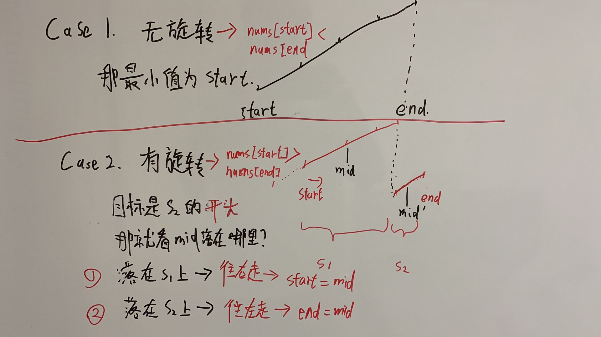
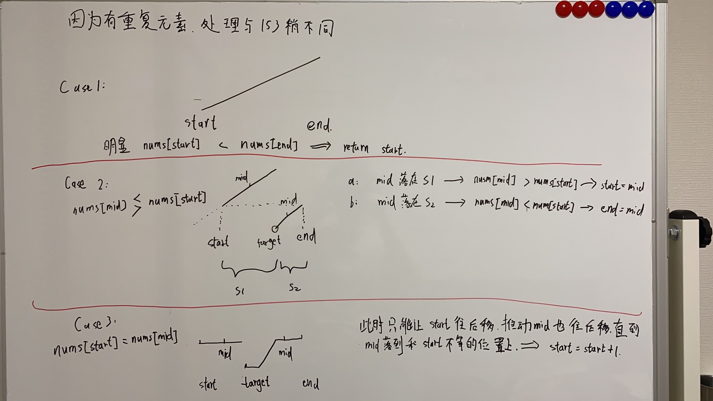
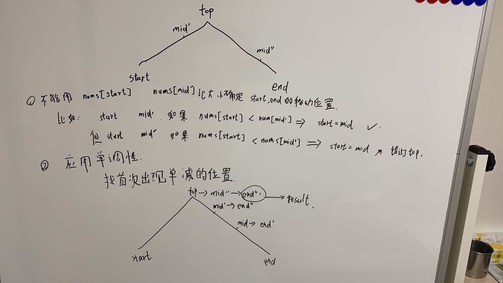
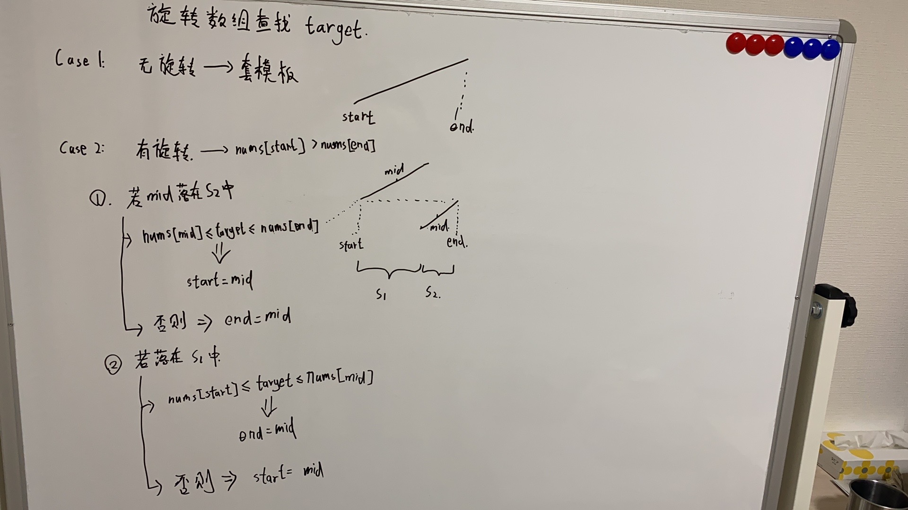

# 1 栈的初始化和基本操作

## 1.1 初始化

```java
Deque<Integer> stack = new ArrayDeque<>();
Deque<Integer> stack = new LinkedList<>();
```

## 1.2 基本操作

```java
// 时间复杂度都是O(1)
stack.push(x);
stack.pop();
stack.peek();
stack.isEmpty();
```


# 2 队列的初始化和基本操作

## 2.1 初始化

```java
Queue<Integer> queue = new LinkedList<>();
```


## 2.2 基本操作

```java
// 时间复杂度都是O(1)
queue.offer();
queue.poll();
queue.peek();
queue.isEmpty()
```


# 3 实战  

## 3.1 双栈实现队列
LIFO + LIFO = FIFO  
[232. 用栈实现队列](https://leetcode.cn/problems/implement-queue-using-stacks/)

```java
class MyQueue {
    // Space: O(n)
    // Time: push, empty O(1)/ pop, peek 因为这个是针对一个元素来进行操作，一个元素最多可以进行的操作只有4个， stack1->in  stack1->out  stack2-> in  stack2->out
    // 所以时间复杂度，算下来是O(1)
    private Deque<Integer> stack1;
    private Deque<Integer> stack2;

    public MyQueue() {
        stack1 = new ArrayDeque<>();
        stack2 = new ArrayDeque<>();
    }
    
    public void push(int x) {
        stack1.push(x);
    }
    
    public int pop() {
        shiftStack();
        return stack2.pop();
    }
    
    public int peek() {
        shiftStack();
        return stack2.peek();
    }
    
    public boolean empty() {
        return stack1.isEmpty() && stack2.isEmpty();
    }

    // 为什么要把stack1的数字倒腾进stack2，是因为LIFO + LIFO = FIFO
    // 加上if (stack2.isEmpty()) 是因为如果前一次把stack1的数据倒进了stack2中，然后又push了几个到stack1，没有if做判断的会，会把队列顶部的元素给替换掉
    private void shiftStack() {
        if (stack2.isEmpty()) {
            while (!stack1.isEmpty()) {
                stack2.push(stack1.pop());
            }
        }
    }
}
```

## 3.2 最小栈

[155. 最小栈](https://leetcode.cn/problems/min-stack/)

```java
class MinStack {

    // Time: O(1)  Space: O(n)
    // 双栈，最小栈随着每次push，都记录一个最小值。但是初始化的时候要记录一个最大的数防止空指针

    private Deque<Integer> stack;
    private Deque<Integer> minStack;

    public MinStack() {
        stack = new LinkedList<>();
        minStack = new LinkedList<>();
        minStack.push(Integer.MAX_VALUE);   // 加这个是为了防止push方法的空指针
    }
    
    public void push(int val) {
        stack.push(val);
        minStack.push(Math.min(val, minStack.peek()));
    }
    
    public void pop() {
        stack.pop();
        minStack.pop(); // minStack别忘记Pop
    }
    
    public int top() {
        return stack.peek();
    }
    
    public int getMin() {
        return minStack.peek();
    }
}
```

## 3.3 有效括号

[20. 有效的括号](https://leetcode.cn/problems/valid-parentheses/)
```java
class Solution {

    // Time: O(n)  Space: O(n)
    public boolean isValid(String s) {
        // 如果为空或者奇数个，肯定不满足
        if (s == null || s.length() == 0 || s.length() % 2 != 0) {
            return false;
        }

        // 遇到左括号押栈，右括号弹栈并且比较
        Deque<Character> stack = new ArrayDeque<>();
        for (int i = 0; i < s.length(); i++) {
            char ch = s.charAt(i);

            if (isLeftParenthesis(ch)) {
                stack.push(ch);
            } else {
                // 如果是右括号，先看看栈里面有没有元素，如果没有说明右括号多余，直接返回即可
                if (stack.isEmpty()) {
                    return false;
                }

                // 如果栈有元素，那么就进行有效性比较
                char left = stack.pop();
                if (!isValid(left, ch)) {
                    return false;
                }
            }
        }

        // 防止都是做括号，应该返回栈是否是空的信息
        return stack.isEmpty();
    }

    private boolean isLeftParenthesis(char ch) {
        return (ch == '(') || (ch == '{') || (ch == '[');
    }

    private boolean isValid (char left, char right) {
        if (right == ')') {
            return left == '(';
        } else if (right == '}') {
            return left == '{';
        } else if (right == ']') {
            return left == '[';
        } else {
            return false;
        }
    }
}
```


## 3.4 逆波兰表达式

[150. 逆波兰表达式求值](https://leetcode.cn/problems/evaluate-reverse-polish-notation/)

```java
class Solution {
    // 遇到数字压栈，遇到操作符弹出两个数字，计算后再压栈。
    // Time: O(n)  Space: O(n)
    public int evalRPN(String[] tokens) {

        Deque<Integer> deque = new ArrayDeque<>();
        for (int i = 0; i < tokens.length; i++) {
            String token = tokens[i];

            if (isOperator(token)) {
                int lastNum = deque.pop();
                int firstNum = deque.pop();

                int result = operate(firstNum, lastNum, token);
                deque.push(result);
            } else {
                deque.push(Integer.parseInt(token));
            }
        }
        return deque.pop();
    }

    private boolean isOperator(String token) {
        return ("+".equals(token)) || ("-".equals(token)) || ("*".equals(token)) || ("/".equals(token));
    }

    private int operate(int firstNum, int lastNum, String token) {
        if ("+".equals(token)) {
            return firstNum + lastNum;
        } else if ("-".equals(token)) {
            return firstNum - lastNum;
        } else if ("*".equals(token)) {
            return firstNum * lastNum;
        } else {
            return firstNum / lastNum;
        }
    }
}
```


## 3.5 单调栈

在栈的FIFO基础上增加一个额外的特性：从栈顶（栈低）到栈低（栈顶）的元素是严格递增或者严格递减。
### 单调递减栈-从栈低到栈顶单调递减
- 只要比栈顶元素小的元素才能直接进栈，否则需要先将栈中比当前元素小的元素都出栈，再将当前元素入栈
- 保证栈中保留的都是比当前入栈元素大的值
- 从栈低到栈顶的元素值是单调递减的
- 模板
```java
// 单调递减栈 bottom -> top
Deque<Integer> stack = new ArrayDeque<>();
for (int i = 0; i < nums.length; i++) {
    while (!stack.isEmpty() && stack.peek() < nums[i]) {
        stack.pop();
    }
    stack.push(nums[i]);
}
```

### 单调递减栈-从栈低到栈顶单调递增
- 只要比栈顶元素大的元素才能直接进栈，否则需要先将栈中比当前元素大的元素都出栈，再将当前元素入栈
- 保证栈中保留的都是比当前入栈元素小的值
- 从栈低到栈顶的元素值是单调递减的
- 模板
```java
// 单调递增栈 bottom -> top
Deque<Integer> stack = new ArrayDeque<>();
for (int i = 0; i < nums.length; i++) {
    while (!stack.isEmpty() && stack.peek() > nums[i]) {
        stack.pop();
    }
    stack.push(nums[i]);
}
```

## 3.6 重要：Next Greater Number问题  

给定一个整型数组nums,要求打印出所有元素右边第一个大于该元素的值。  
case1: 数组nums[1,5,3,6,4,8,9,10] -> [5,6,6,8,8,9,10,-1]  
case2: 数组nums[8.2.5.4.3.9.7.2.5] -> [5,9,9,9,-1,-1,5,-1]    

> 大单减小单增，遍历方向题目中

```java
public int[] findRightNextGreater(int[] nums) {
    // 找大的，单减栈。遍历方向题目中是右
    int[] result = new int[nums.length];
    Arrays.fill(result, -1);

    // 这个栈不装value了，装索引。因为要给result的赋值的时候需要用到索引
    Deque<Integer> stack = new ArrayDeque<>();
    for (int i = 0; i < nums.length; i++) {
        
        // 因为是递减栈，所以新元素 > 顶元素的时候不满足单减，要把栈里面的元素pop掉
        for (!stack.isEmpty() && nums[stack.peek()] < nums[i]) {
            int index = stack.pop();
            result[index] = nums[i];
        }

        stack.push(i);
    }

    return result;
}

public int[] findRightNextSmaill(int[] nums) {
    // 找小的，单增栈。遍历方向题目中是右
    int[] result = new int[nums.length];
    Arrays.fill(result, -1);

    // 这个栈不装value了，装索引。因为要给result的赋值的时候需要用到索引
    Deque<Integer> stack = new ArrayDeque<>();
    for (int i = 0; i < nums.length; i++) {
        
        // 因为是递增栈，所以新元素 < 顶元素的时候不满足单增，要把栈里面的元素pop掉
        for (!stack.isEmpty() && nums[stack.peek()] > nums[i]) {
            int index = stack.pop();
            result[index] = nums[i];
        }

        stack.push(i);
    }

    return result;
}

public int[] findLeftNextGreater(int[] nums) {
    // 找大的，单减栈。遍历方向题目中是左
    int[] result = new int[nums.length];
    Arrays.fill(result, -1);

    // 这个栈不装value了，装索引。因为要给result的赋值的时候需要用到索引
    Deque<Integer> stack = new ArrayDeque<>();
    for (int i = nums.length - 1; i >= 0; i--) {
        
        // 因为是递减栈，所以新元素 > 顶元素的时候不满足单减，要把栈里面的元素pop掉
        for (!stack.isEmpty() && nums[stack.peek()] < nums[i]) {
            int index = stack.pop();
            result[index] = nums[i];
        }

        stack.push(i);
    }

    return result;
}

public int[] findLeftNextSmaill(int[] nums) {
    // 找小的，单增栈。遍历方向题目中是左
    int[] result = new int[nums.length];
    Arrays.fill(result, -1);

    // 这个栈不装value了，装索引。因为要给result的赋值的时候需要用到索引
    Deque<Integer> stack = new ArrayDeque<>();
    for (int i = nums.length - 1; i >= 0; i--) {
        
        // 因为是递增栈，所以新元素 < 顶元素的时候不满足单增，要把栈里面的元素pop掉
        for (!stack.isEmpty() && nums[stack.peek()] > nums[i]) {
            int index = stack.pop();
            result[index] = nums[i];
        }

        stack.push(i);
    }

    return result;
}
```


## 3.7 每日温度

[739. 每日温度](https://leetcode.cn/problems/daily-temperatures/)

```java
class Solution {
  	// Time: O(n)  Space: O(n)
    public int[] dailyTemperatures(int[] temperatures) {
        if (temperatures == null || temperatures.length == 0) {
            return null;
        }

        int[] result = new int[temperatures.length];
        Deque<Integer> stack = new ArrayDeque<>();
        for (int i = 0; i < temperatures.length; i++) {
            while (!stack.isEmpty() && temperatures[stack.peek()] < temperatures[i]) {
                int index = stack.pop();
                result[index] = i - index;
            }

            stack.push(i);
        }

        return result;
    }
}
```


## 3.8 下一个更大元素1

[496. 下一个更大元素 I](https://leetcode.cn/problems/next-greater-element-i/)

```java
class Solution {
    // 因为nums2是超集，只要把nums2的下一个最大元素找出来，那么就能找到nums1
  	// Time: O(n)  Space: O(n)
    public int[] nextGreaterElement(int[] nums1, int[] nums2) {

        // 用Map来记录nums2中每个元素的下一个最大元素
        Map<Integer, Integer> map = new HashMap<>();
        Deque<Integer> stack = new ArrayDeque<>();

        for (int i = 0; i < nums2.length; i++) {
            while (!stack.isEmpty() && stack.peek() < nums2[i]) {	// 主要不要写成 || 脑子要清醒
                int smallNum = stack.pop();
                map.put(smallNum, nums2[i]);
            }

            stack.push(nums2[i]);
        }

        // 遍历num1找到下一个最大元素
        int[] result = new int[nums1.length];
        for (int i = 0; i < nums1.length; i++) {
            result[i] = map.getOrDefault(nums1[i], -1);
        }
        return result;
    }
}
```


## 3.9 下一个更大元素2

[503. 下一个更大元素 II](https://leetcode.cn/problems/next-greater-element-ii/)

```java
class Solution {
    // 因为是循环的数组，所以遍历的时候把长度编程两倍，这样最后一个元素就可以在下一遍遍历里面找比他大的元素了
    // 索引怎么办呢？ 用当前索引对长度取模，就能找到第二圈的元素的值
  	// Time: O(n)  Space: O(n)
    public int[] nextGreaterElements(int[] nums) {
        int[] result = new int[nums.length];
        Arrays.fill(result, -1);

        Deque<Integer> stack = new ArrayDeque<>();
        int len = nums.length;
        for (int i = 0; i < len * 2; i++) {	// 这里是len * 2
            while (!stack.isEmpty() && nums[stack.peek()] < nums[i % len]) { // 取余数的时候要对原来的length取
                int index = stack.pop();
                result[index] = nums[i % len];	// 下一个更大的值，就是还未入栈的新值
            }

            stack.push(i % len);
        }
        return result;
    }
}
```


## 4.0 柱状图中最大矩形

[84. 柱状图中最大的矩形](https://leetcode.cn/problems/largest-rectangle-in-histogram/)

```java
class Solution {
    // 思路： 求最大矩形的面积，就看每根柱子两侧首次小于此柱子高度的位置。记录下这两个位置right和left
    // 那么right - left - 1就是宽度（为什么要减去1呢？ 带入特殊值计算一下即可得到right - left是多着一个1的）
    // 高度就是当前柱子的高度
    // 那么问题就转化成为了求每个元素右边下个小值 -> 递增栈，左到右
    //                  求每个元素左边下个小值 -> 递增栈，右到左
    // 然后遍历height数组，求醉最大面积即可
    // PS：需要注意的是特殊的边界情况。对于第一个元素，他左边的高度设置为0，且索引为-1. 最后一个元素高度为0，索引为length
    //     更加极端的一些情况是如果每个元素都相等，那么每个元素左边的第一个较小值都是-1，右边的较大值都是length，所以初始化left和right数组的时候都填充上-1， length即可
  	// Time: O(n)  Space: O(n)
    public int largestRectangleArea(int[] heights) {
        
        int[] left = new int[heights.length];
        int[] right = new int[heights.length];
        // 处理特殊边界
        Arrays.fill(left, -1);
        Arrays.fill(right, heights.length);

        // 每个元素右边下个小元素边界
        Deque<Integer> stack = new ArrayDeque<>();
        for (int i = 0; i < heights.length; i++) {
            while (!stack.isEmpty() && heights[stack.peek()] > heights[i]) {
                int index = stack.pop();
                right[index] = i;
            }
            stack.push(i);
        }

        // 每个元素左边下个小元素边界
        stack.clear();
        for (int i = heights.length - 1; i >= 0; i--) {
            while (!stack.isEmpty() && heights[stack.peek()] > heights[i]) {
                int index = stack.pop();
                left[index] = i;
            }
            stack.push(i);
        }

        // 计算每个柱子能构成的最大面积，注意宽度是right - left - 1，别忘了-1
        int result = 0;
        for (int i = 0; i < heights.length; i++) {
            result = Math.max(result, (right[i] - left[i] - 1) * heights[i]);
        }
        return result;
    }
}
```

```java
class Solution {

    // 一次栈遍历
    public int largestRectangleArea(int[] heights) {

        int len = heights.length;
        int[] left = new int[len];
        int[] right = new int[len];
        Arrays.fill(right, len);
        Deque<Integer> stack = new ArrayDeque<>();

        for (int i = 0; i < len; i++) {
            while (!stack.isEmpty() && heights[stack.peek()] >= heights[i]) {   // 绝对单调递增栈
                int index = stack.pop();
                right[index] = i;
            }
            // 每次入栈就得要计算左边界, 如果栈是空的，那么-1就是边界，如果栈不是空的，因为站内是递增的，所以栈顶的元素一定是弹出元素的左边界
            left[i] = stack.isEmpty() ? -1 : stack.peek();
            stack.push(i);
        }

        // 计算面积
        int result = 0;
        for (int i = 0; i < len; i++) {
            result = Math.max(result, (right[i] - left[i] - 1) * heights[i]);   // 记得写result = ，低级错误
        }
        return result;
    }
}
```

## 4.1 接雨水

#### [42. 接雨水](https://leetcode.cn/problems/trapping-rain-water/)


 ```java
 class Solution {
     // 算存储雨水需要有3个数字，left边界，弹栈元素，有边界。想要存储雨水那必须左右边界的高度比弹栈元素高度高，只有递减栈可以满足这个需求
     // 依次放入元素到递减栈，不满足递减的时候弹出一个元素，那这时候 left: stack.peek() 弹出元素 right: nums[i]
     // 计算能存储多少雨水就是 (Math.min(height[right], hright[left]) - height[弹出元素]) * (right -left -1)
     // 每次弹出栈的时候计算面积。 但是有个前提是计算的时候栈内必须要有元素，不然left边界没有的话就不能存储雨水
 		// Time: O(n)  Space: O(n)
     public int trap(int[] height) {
 
         int len = height.length;
         Deque<Integer> stack = new ArrayDeque<>();
         int result = 0;
 
         for (int i = 0; i < len; i++) {
             while (!stack.isEmpty() && height[stack.peek()] < height[i]) {
                 int index = stack.pop();
                 // 只有有做边界的时候才能存雨水，所以要看一下stack是不是空
                 if (!stack.isEmpty()) {
                     result += (Math.min(height[i], height[stack.peek()]) - height[index]) * (i - stack.peek() - 1);
                 }
             }
             stack.push(i);
         }
 
         return result;
     }
 }
 ```


# 5 二分查找 O(logn)

## 5.1 模板

- 对输入做异常处理：数组为空或者数组长度为0
- Recusion or While-Loop：使用迭代而不是递归进行二分查找，因为工程中递归写法存在溢出的可能
- while循环终止条件：while终止条件应该为start+1<end而不是start<=end，start==end时可能出现死循环，积循环终止条件是相邻或者相交元素时退出。配合while终止条件start+1<end（相邻即退出）的赋值语句mid永远没有+1或者-1，这样不会出现死循环。
- int mid = start + (end - start) / 2这种表示方法可以防止两个整形值相加时溢出
- 迭代终止时target应为start或者end中的一个。循环终止条件有两个，具体应看是找第一个还是最后一个而定

```java
class Solution {
	public int binarySearch(int[] nums, int target) {
        if (nums == null || nums.length == 0) {
            return -1;
        }

        int start = 0;
        int end = nums.length - 1;

        while (start + 1 < end) {
            int mid = start + (end - start) / 2;
            if (target < nums[mid]) {
                end = mid;
            } else if (target > nums[mid]) {
                start = mid;
            } else {
                end = mid;
            }
        }

        if (nums[start] == target) {
            return start;
        }
        if (nums[end] == target) {
            return end;
        }

        return -1;
    }
}
```


## 5.2 二分查找

[704. 二分查找](https://leetcode.cn/problems/binary-search/)

```java

class Solution {
    public int search(int[] nums, int target) {
        if (nums == null || nums.length == 0) {
            return -1;
        }

        int start = 0;
        int end = nums.length - 1;

        while (start + 1 < end) {
            int mid = start + (end - start) / 2;
            if (nums[mid] < target) {
                start = mid;
            } else if (nums[mid] > target) {
                end = mid;
            } else {
                end = mid;
            }
        }

        if (nums[start] == target) {
            return start;
        }
        if (nums[end] == target) {
            return end;
        }
        return -1;
    }
}
```

## 5.3 第一个错误的版本

[278. 第一个错误的版本](https://leetcode.cn/problems/first-bad-version/)

```java
public class Solution extends VersionControl {
    public int firstBadVersion(int n) {
        if (n <= 0) {
            return -1;
        }

        int start = 1;
        int end = n;

        while (start + 1 < end) {
            int mid = start + (end - start) / 2;
            if (!isBadVersion(mid)) {
                start = mid;
            } else {
                end = mid;
            }
        }

        if (isBadVersion(start)) {
            return start;
        } else {
            return end;
        }
    }
}
```


## 5.4 在排序数组中查找元素的第一个和最后一个位置

[34. 在排序数组中查找元素的第一个和最后一个位置](https://leetcode.cn/problems/find-first-and-last-position-of-element-in-sorted-array/)

```java
class Solution {
    public int[] searchRange(int[] nums, int target) {
        int[] result = new int[2];
        result[0] = -1;
        result[1] = -1;

        if (nums == null || nums.length == 0) {
            return result;
        }

        int start = 0;
        int end = nums.length - 1;

        // 因为有重复的元素，所以找的时候分两次来找，第一次找开头的位置，让mid和target相等时，让end=mid，这样找完的时候end就会在第一个出现目标值的索引上面
        while (start + 1 < end) {
            int mid = start + (end - start) / 2;
            if (target <= nums[mid]) {
                end = mid;
            } else {
                start = mid;
            }
        }
        if (nums[start] == target) {
            result[0] = start;
        } else if (nums[end] == target) {
            result[0] = end;
        } else {
            return result;
        }

        // 这次找结尾的元素
        start = 0;
        end = nums.length - 1;

        while (start + 1 < end) {
            int mid = start + (end - start) / 2;
            if (target >= nums[mid]) {
                start = mid;
            } else {
                end = mid;
            }
        }

        if (nums[end] == target) {
            result[1] = end;
        } else if (nums[start] == target) {
            result[1] = start;
        }

        return result;
    }
}
```

```java
class Solution {
    public int[] searchRange(int[] nums, int target) {
        int len = nums.length;
        if (len == 0) {
            return new int[] {-1, -1};
        }

        int firstPosition = findFirstPosition(nums, target);
        if (firstPosition == -1) {
            return new int[] {-1, -1};
        }
        int lastPosition = findLastPosition(nums, target);
        return new int[] {firstPosition, lastPosition};
    }

    private int findFirstPosition(int[] nums, int target) {
        int left = 0;
        int right = nums.length - 1;

        // 这里写成left <= right的话，加入left = right = mid = 3 那么会死循环
        while (left < right) {
            int mid = (left + right) / 2;
            if (nums[mid] >= target) {
                // mid 有可能是target第一次出现的位置，
                // mid之后一定不是target首次出现的位置
                // 下一轮搜索区间【left， mid】
                right = mid;
            } else {
                // 下一轮搜索区间【mid + 1， right】
                left = mid + 1;
            }
        }

        if (nums[left] == target) {
            return left;
        }

        return -1;
    }

    private int findLastPosition(int[] nums, int target) {
        int left = 0;
        int right = nums.length - 1;

        // 由于第一个方法里面判断过了left right重合以后，一定是target，所以这个方法里面就不用再次判断
        // 直接left < right即可。因为当他们重合以后，一定是要找的target
        while (left < right) {

            // 加入left = 4 right = 5 mid = 4 求mid的时候如果使用这种方法 int mid = (left + right + 1) / 2;
            // 会造成死循环，所以使用下面的加1 方法
            int mid = (left + right + 1) / 2;
            if (nums[mid] <= target) {
                // mid有可能是target最后一次的位置
                // mid之前的不可能是target最后一次出现的位置
                // 下次搜索区间【mid, right】
                left = mid;
            } else {
                // mid大于target，那么说明mid之后的都大于target
                // 下次搜索区间【left, mid - 1】
                right = mid - 1;
            }
        }

        return left;
    }
}
```


## 5.5 搜索插入位置

[35. 搜索插入位置](https://leetcode.cn/problems/search-insert-position/)

```java
class Solution {
    // 二分查找：根据题目描述，找的是第一个大于等于target的索引，那么使用二分查找，先判断start，在判断end
    // 有个特殊情况就是，当target比数组中的所有元素都打的时候，那么应该插入的地方是end+1
    public int searchInsert(int[] nums, int target) {
        if (nums == null || nums.length == 0) {
            return -1;
        }

        int start = 0;
        int end = nums.length - 1;

        while (start + 1 < end) {
            int mid = start + (end - start) / 2;
            if (target == nums[mid]) {
                end = mid;
            } else if (target > nums[mid]) {
                start = mid;
            } else {
                end = mid;
            }
        }

        if (nums[start] >= target) {
            return start;
        } else if (nums[end] >= target) {
            return end;
        } else {
            return end + 1;
        }
    }
}
```


## 5.5 搜索二维矩阵

矩阵中行列计算，坐标转换计算技巧：

行数：m

列数：n

二维坐标转换到一维：**row * n + col**    (row, col是这个元素的第row行，第col列)

一维坐标转换到二维：**x = index / n,  y = index % n** 

[74. 搜索二维矩阵](https://leetcode.cn/problems/search-a-2d-matrix/)

```java
class Solution {
    // 把二维坐标当成一维来计算。 Time: O(log(m * n))
    // 二维坐标转换到一维：row * n + col    (row, col是这个元素的第row行，第col列)
    // 一维坐标转换到二维：x = index / n,  y = index % n 
    public boolean searchMatrix(int[][] matrix, int target) {
        if (matrix == null || matrix.length == 0 || matrix[0].length == 0) {
            return false;
        }

        int m = matrix.length;
        int n = matrix[0].length;
        int start = 0;
        int end = m * n - 1;

        while (start + 1 < end) {
            int mid = start + (end - start) / 2;
            int x = mid / n;
            int y = mid % n;

            if (target == matrix[x][y]) {
                end = mid;
            } else if (target < matrix[x][y]) {
                end = mid;
            } else {
                start = mid;
            }
        }

        if (target == matrix[start / n][start % n] || target == matrix[end / n][end % n]) {
            return true;
        }

        return false;
    }
}
```


## 5.6 搜索二维矩阵 II

[240. 搜索二维矩阵 II](https://leetcode.cn/problems/search-a-2d-matrix-ii/)

解题方法是右上到左下

```java
class Solution {
    // 右上到左下查询，Time: O(m + n)
    public boolean searchMatrix(int[][] matrix, int target) {
        if (matrix == null || matrix.length == 0 || matrix[0].length == 0) {
            return false;
        }

        int m = matrix.length;
        int n = matrix[0].length;
        int x = 0;
        int y = n - 1;

        while (x < m && y >= 0) {
            if (matrix[x][y] == target) {
                return true;
            } else if (matrix[x][y] < target) {
                x++;
            } else {
                y--;
            }
        }
        return false;
    }
}
```


## 5.7 数组区间有序

[153. 寻找旋转排序数组中的最小值](https://leetcode.cn/problems/find-minimum-in-rotated-sorted-array/)

无重复元素

 

```java
class Solution {
    // O(logn)
    public int findMin(int[] nums) {
        if (nums == null || nums.length == 0) {
            return -1;
        }

        int start = 0;
        int end = nums.length - 1;

        while (start + 1 < end) {
            // 先判断是不是旋转过，没旋转过直接返回start
            if (nums[start] < nums[end]) {
                return nums[start];
            }

            // 旋转过的话，要向s2的开头靠过去
            int mid = start + (end - start) / 2;
            if (nums[mid] > nums[start]) {
                start = mid;
            } else {
                end = mid;
            }
        }

        return Math.min(nums[start], nums[end]);
    }
}
```


[154. 寻找旋转排序数组中的最小值 II](https://leetcode.cn/problems/find-minimum-in-rotated-sorted-array-ii/)

有重复元素

 
```java
class Solution {
    public int findMin(int[] nums) {
        if (nums == null || nums.length == 0) {
            return -1;
        }

        int start = 0;
        int end = nums.length - 1;

        while (start + 1 < end) {
            // 先判断是不是旋转过，没旋转过直接返回start
            if (nums[start] < nums[end]) {
                return nums[start];
            }

            // 旋转过的话，要向s2的开头靠过去
            int mid = start + (end - start) / 2;
            if (nums[mid] > nums[start]) {
                start = mid;
            } else if (nums[mid] < nums[start]){
                end = mid;
            } else {
                start = start + 1;
            }
        }

        return Math.min(nums[start], nums[end]);
    }
}
```


## 5.8 山脉数组

先增后减然后求最大值

[852. 山脉数组的峰顶索引](https://leetcode.cn/problems/peak-index-in-a-mountain-array/)



```java
class Solution {
    // 先增后减数组求最大值 Time: O(logn)
    public int peakIndexInMountainArray(int[] arr) {
        if (arr == null || arr.length == 0) {
            return -1;
        }

        int start = 0;
        int end = arr.length - 1;
        int result = -1;

        while (start + 1 < end) {
            int mid = start + (end - start) / 2;

            if (arr[mid] > arr[mid + 1]) {
                end = mid;
                result = end;
            } else {
                start = mid;
            }
        }

        return result;
    }
}
```


## 5.9 搜索旋转排序数组

[33. 搜索旋转排序数组](https://leetcode.cn/problems/search-in-rotated-sorted-array/)

 

```java
class Solution {
    // Time: O(logn)
    public int search(int[] nums, int target) {
        if (nums == null || nums.length == 0) {
            return -1;
        }

        int start = 0;
        int end = nums.length - 1;

        while (start + 1 < end) {
            int mid = start + (end - start) / 2;

            if (nums[mid] == target) {
                return mid;
            }

            // 发生了旋转
            if (nums[start] > nums[mid]) {
                if (nums[mid] <= target && target <= nums[end]) {
                    start = mid;
                } else {
                    end = mid;
                }
            } else {
                if (nums[start] <= target && target <= nums[mid]) {
                    end = mid;
                } else {
                    start = mid;
                }
            }
        }

        if (nums[start] == target) {
            return start;
        }

        if (nums[end] == target) {
            return end;
        }

        return -1;
    }
}
```


## 6.0 69. x 的平方根

[69. x 的平方根 ](https://leetcode.cn/problems/sqrtx/)

```java
class Solution {
    // 假如传进来时100. 那就用【0， 100】的二分来找
    // 50 * 50 > 100  => 太大了，范围缩减一半【1， 50】
    // 25 * 25 > 100  => 太大了，范围缩减一半【1， 25】
    // 12 * 12 > 100  => 太大了，范围缩减一半【1， 12】
    // 12 * 12 > 100  => 太大了，范围缩减一半【1， 12】
    // 6 * 6 < 100   => 太小了，范围增加一半【6， 12】
    // 9 * 9 < 100   => 太小了，范围增加一半【9， 12】
    // 10 * 10 ==100 OK
    public int mySqrt(int x) {
        if (x == 0) {
            return 0;
        }

        int start = 1;
        int end = x;

        while (start + 1 < end) {
            int mid = start + (end - start) / 2;
            if (x / mid == mid) {
                return mid;
            } else if (mid < x / mid) {
                start = mid;
            } else {
                end = mid;
            }
        }

        if (start <= x / start) {
            return start;
        }
        if (end <= x / end) {
            return end;
        }
        return -1;
    }
}
```

