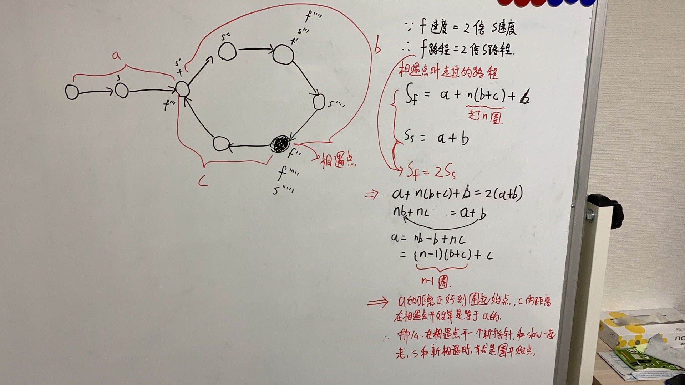

# 1 链表理论

## 1.1 什么是链表

链表是一种线性表，但是并不会按线性顺序存储数据，而是在每一个节点里存到下一个节点的指针(Pointer)


# 2 实战

## 2.1 得到链表中点元素

[876. 链表的中间结点](https://leetcode.cn/problems/middle-of-the-linked-list/)

### brute force

遍历两次

```java
/**
 * Definition for singly-linked list.
 * public class ListNode {
 *     int val;
 *     ListNode next;
 *     ListNode() {}
 *     ListNode(int val) { this.val = val; }
 *     ListNode(int val, ListNode next) { this.val = val; this.next = next; }
 * }
 */
class Solution {
    public ListNode middleNode(ListNode head) {
        int length = getLength(head);
        int index = length / 2;

        ListNode cur = head;
        while (index-- != 0) {
            cur = cur.next;
        }

        return cur;
    }

    private int getLength(ListNode head) {
        ListNode cur = head;
        int length = 0;

        while (cur != null) {
            length++;
            cur = cur.next;
        }
        return length;
    }
}
```


### 双指针

遍历一次，快慢指针

```java
/**
 * Definition for singly-linked list.
 * public class ListNode {
 *     int val;
 *     ListNode next;
 *     ListNode() {}
 *     ListNode(int val) { this.val = val; }
 *     ListNode(int val, ListNode next) { this.val = val; this.next = next; }
 * }
 */
class Solution {

    // 快慢指针，快指针每次走两步，慢指针每次走一步
    // 分析下来，节点个数是奇数，那么慢指针是最后想要的答案。节点个数是偶数，那么慢指针还需要再走一步才能走到中间位置
    public ListNode middleNode(ListNode head) {
        ListNode fast = head;
        ListNode slow = head;

        while (fast.next != null && fast.next.next != null) {
            fast = fast.next.next;
            slow = slow.next;
        }

        // 节点个数是偶数个的时候
        while (fast.next != null) {
            fast = fast.next;
            slow = slow.next;
        }
        return slow;
    }
}
```


## 2.2 链表中倒数第k个节点

[剑指 Offer 22. 链表中倒数第k个节点](https://leetcode.cn/problems/lian-biao-zhong-dao-shu-di-kge-jie-dian-lcof/)

### brute force

遍历两次

```java
/**
 * Definition for singly-linked list.
 * public class ListNode {
 *     int val;
 *     ListNode next;
 *     ListNode(int x) { val = x; }
 * }
 */
class Solution {
    // 假如长度是5，那倒数第2个就是整数第5-2=3个（这个3是索引）
    public ListNode getKthFromEnd(ListNode head, int k) {
        int index = getLength(head) - k;

        ListNode cur = head;
        while (index-- != 0) {
            cur = cur.next;
        }
        return cur;
    }

    private int getLength(ListNode head) {
        int length = 0;
        ListNode cur = head;

        while (cur != null) {
            length++;
            cur = cur.next;
        }
        return length;
    }
}
```


### 快慢指针

遍历一次

```java
/**
 * Definition for singly-linked list.
 * public class ListNode {
 *     int val;
 *     ListNode next;
 *     ListNode(int x) { val = x; }
 * }
 */
class Solution {
    // 快指针先走k步以后，慢指针在跟上走
    public ListNode getKthFromEnd(ListNode head, int k) {
        ListNode fast = head;
        ListNode slow = head;

        while (k-- != 0) {
            fast = fast.next;
        }

        while (fast != null) {
            fast = fast.next;
            slow = slow.next;
        }

        return slow;
    }

}
```


## 2.3 环形链表

[141. 环形链表](https://leetcode.cn/problems/linked-list-cycle/)

模板题，快慢指针

```java
/**
 * Definition for singly-linked list.
 * class ListNode {
 *     int val;
 *     ListNode next;
 *     ListNode(int x) {
 *         val = x;
 *         next = null;
 *     }
 * }
 */
public class Solution {
    // 快慢指针，快的会追上慢的
    public boolean hasCycle(ListNode head) {
        if (head == null || head.next == null) {
            return false;
        }

        ListNode fast = head;
        ListNode slow = head;

        while (fast != null && fast.next != null) {
            fast = fast.next.next;
            slow = slow.next;

            // 判断放在移动指针后面，因为首次进入while的时候，快慢都指向了head，会直接判断成功
            if (fast == slow) {
                return true;
            }
        }
        return false;
    }
}
```


## 2.4 环形链表2

[142. 环形链表 II](https://leetcode.cn/problems/linked-list-cycle-ii/)

1. 判相遇
2. cur=slow相遇点就是如环点

 

```java
/**
 * Definition for singly-linked list.
 * class ListNode {
 *     int val;
 *     ListNode next;
 *     ListNode(int x) {
 *         val = x;
 *         next = null;
 *     }
 * }
 */
public class Solution {
    public ListNode detectCycle(ListNode head) {
        if (head == null || head.next == null) {
            return null;    // 应该返回空，而不是head。如果head只有一个节点，应该返回null
        }

        ListNode fast = head;
        ListNode slow = head;

        while (fast != null && fast.next != null) {
            fast = fast.next.next;
            slow = slow.next;

            if (fast == slow) {
                ListNode cur = head;

                while (slow != cur) {
                    slow = slow.next;
                    cur = cur.next;
                }

                return cur;
            }
        }
        return null;
    }
}
```

