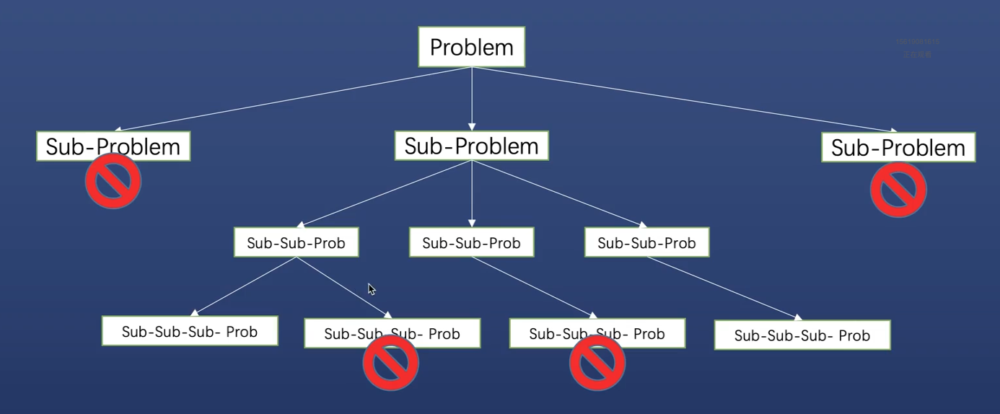
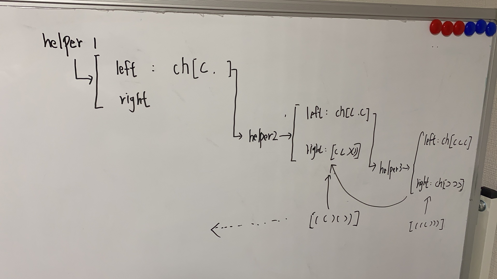
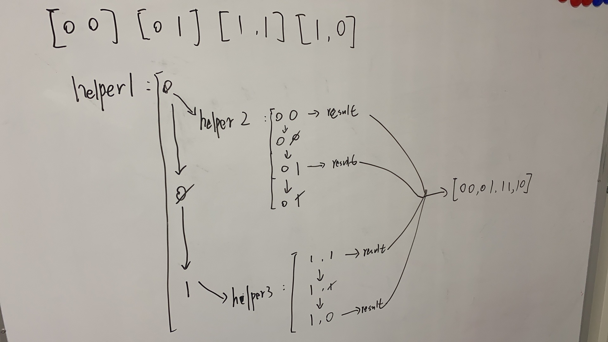
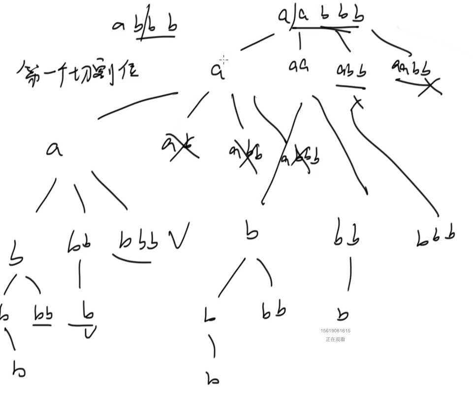

# 1 回溯法

## 1.1 题目特点

- 大多数为dfs问题中的一维问题，少数为二叉树或者矩阵
- 【重要】实现：DFS+剪枝
- 【重要】找出所有方案（大多数）/找出最优方案（极少）：要想到回溯法
- 【重要】大多数题目可分为组合问题或者排列问题


## 1.2 什么是回溯法

### 从递归问题说起看回溯




## 1.3 回溯模板心法

- 组合：求子集问题
- 排列：求排列问题


### 组合问题

- 求所有满足条件的组合，本质就是求子集
- 解空间树结构为子集树
- 时间复杂度：O(2^n)
- 组合/子集问题的解中元素常与顺序无关
- 求解会挑选原数据集的部分元素而不是全部


### 排列

- 我爱罗/我罗爱/爱我罗/爱罗我/罗我爱/罗爱我
- 解空间树结构为排列树
- 时间复杂度O(n!)
- 排列问题的解中选素常与顺序相关
- 求解会挑选原数据集的全部元素


### 模板

```java
public List<List<Integer>> solveProblem(int[] nums) {
  // result list
  List<List<Integer>> result = new ArrayList<>();
  
  // check empty
  if (nums == null || nums.length == 0) {
    return result;
  }
  
  // single answer
  List<Integer> list = new ArrayList<>();
  
  // sort nums if necessary
  // Arrays.sort(nums);
  
  helper(result, list, nums, ?);
  
  return result
}

private void helper(List<List<Integer>> result, List<Integer> list, int[] nums, int pos, ?){
  // end recursion condition
  if (condition xx) {
    return;
  }
  
  // add single answer into result
  if (condition xx) {
    result.add(new ArrayList(list));
  }
  
  // 剪枝
  if (condition xx) {
    // doSomething
    return;
  }
  
  // 递归拆解子问题到下一层
  for (sub : total-subs) {
    if (condition xx) {
      // 剪枝
      break; // or continue;
    }
    list.add(element);
    helper(result, list, nums, ?);
    // 回溯
    list.remove(element);
  }
}
```


## 1.4 实战

### 子集

[78. 子集](https://leetcode.cn/problems/subsets/)

```java
class Solution {
    public List<List<Integer>> subsets(int[] nums) {
        // 解集
        List<List<Integer>> result = new ArrayList<>();

        // 校验input
        if (nums == null || nums.length == 0) {
            return result;
        }

        // 单一解
        List<Integer> list = new ArrayList<>();

        // 排序（本题不需要）
        // Arrays.sort(nums);

        // 计算解集：把单一list放入result中
        helper(result, list, nums, 0);

        return result;
    }

    private void helper(List<List<Integer>> result, List<Integer> list, int[] nums, int pos) {
        // 1 什么时候退出递归

        // 2 什么时候可以把单一解加(Deep copy)入到result中 -> 重点
        result.add(new ArrayList<Integer>(list));

        // 3 递归分解成子问题，到下一层（可能需要剪枝）
        for (int i = pos; i < nums.length; i++) {
            // (1) 把nums[i]加到单一解list中
            list.add(nums[i]);
            // (2) 递归计算以nums[i]结尾的子序列的单一解
            helper(result, list, nums, i + 1);
            // (3) 回溯，去掉最后一个元素
            list.remove(list.size() - 1);
        }
    }
}
```


### 子集2

[90. 子集 II](https://leetcode.cn/problems/subsets-ii/)

```java
class Solution {

    public List<List<Integer>> subsetsWithDup(int[] nums) {
        // 解集
        List<List<Integer>> result = new ArrayList<>();

        // 校验input
        if (nums == null || nums.length == 0) {
            return result;
        }

        // 单一解
        List<Integer> list = new ArrayList<>();

        // 排序
        Arrays.sort(nums);

        // 计算解集：把单一list放入result中
        helper(result, list, nums, 0);

        return result;
    }

    private void helper(List<List<Integer>> result, List<Integer> list, int[] nums, int pos) {
        // 1 什么时候退出递归

        // 2 什么时候可以把单一解加(Deep copy)入到result中 -> 重点
        result.add(new ArrayList<Integer>(list));

        // 3 递归分解成子问题，到下一层（可能需要剪枝）
        for (int i = pos; i < nums.length; i++) {
            // 剪枝
            if (i != pos && nums[i] == nums[i - 1]) {
                continue;
            }

            // (1) 把nums[i]加到单一解list中
            list.add(nums[i]);
            // (2) 递归计算以nums[i]结尾的子序列的单一解
            helper(result, list, nums, i + 1);
            // (3) 回溯，去掉最后一个元素
            list.remove(list.size() - 1);
        }
    }
}
```


### 全排列

nums数组长度为n，全排列的个数为n!

[46. 全排列](https://leetcode.cn/problems/permutations/)

```java
class Solution {
  
  	// Time: O(n!)
    public List<List<Integer>> permute(int[] nums) {
        List<List<Integer>> result = new ArrayList<>();
        if (nums == null || nums.length == 0) {
            return result;
        }

        List<Integer> list = new ArrayList<>();
        helper(result, list, nums);

        return result;
    }

    private void helper(List<List<Integer>> result, List<Integer> list, int[] nums) {
        if (list.size() == nums.length) {
            result.add(new ArrayList<Integer>(list));
            return;
        }

        for (int i = 0; i < nums.length; i++) {
            if (list.contains(nums[i])) {
                continue;
            }
            list.add(nums[i]);
            helper(result, list, nums);
            list.remove(list.size() - 1);
        }
    }
}
```


### 全排列2

[47. 全排列 II](https://leetcode.cn/problems/permutations-ii/)

如果有重复元素，选择靠前的，后面的全部都是重复

```java
class Solution {
    public List<List<Integer>> permuteUnique(int[] nums) {
        List<List<Integer>> result = new ArrayList<>();
        if (nums == null || nums.length == 0) {
            return result;
        }

        List<Integer> list = new ArrayList<>();
        boolean[] visited = new boolean[nums.length]; // 访问过就是true
        Arrays.sort(nums);
        
        helper(result, list, nums, visited);

        return result;
    }

    private void helper(List<List<Integer>> result, List<Integer> list, int[] nums, boolean[] visited) {
        if (list.size() == nums.length) {
            result.add(new ArrayList<Integer>(list));
            return;
        }

        for (int i = 0; i < nums.length; i++) {
            // 【1，1，1】： 到底是已经访问过了
            // 【1(1), 1(2), 2】【1(2), 1(1), 2】重复元素. 第一轮的时候会把第一个list装进result，然后第一个1(1)在被
            // 重制为false。 第二轮的时候，发现如果元素相等，并且前一个没被访问过，说明前一轮被重置成false，那么应该跳过当前元素
            if (visited[i] || (i != 0 && nums[i] == nums[i - 1] && !visited[i - 1])) {
                // 如果有重复元素，选择靠前的，后面的全部都是重复.!nums[i - 1]条件保证了选择靠前的
                // 如果回溯到了靠后的相同元素，会执行continue来跳过。
                continue;
            }
            
            list.add(nums[i]);
            visited[i] = true;
            helper(result, list, nums, visited);
            list.remove(list.size() - 1);
            visited[i] = false;
        }
    }
}
```


### 组合总和

[39. 组合总和](https://leetcode.cn/problems/combination-sum/)

```java
class Solution {
    public List<List<Integer>> combinationSum(int[] candidates, int target) {
        List<List<Integer>> result = new ArrayList<>();

        if (candidates == null || candidates.length == 0) {
            return result;
        }

        List<Integer> list = new ArrayList<>();
        helper(result, list, candidates, target, 0);
        return result;
    }

    private void helper(List<List<Integer>> result, List<Integer> list, int[] candidates, int target, int pos) {
        // 递归什么时候退出？
        // 单一解什么时候加入result
        if (target == 0) {
            result.add(new ArrayList<Integer>(list));
        }

        // 如果target<0 ,应该直接退出. 剪枝
        if (target < 0) {
            return;
        }

        // 递归，到下一层
        for (int i = pos; i < candidates.length; i++) {
            list.add(candidates[i]);

            helper(result, list, candidates, target - candidates[i], i); // pos取i，因为一个数字可以被多次取

            list.remove(list.size() - 1);
        }
    }
}
```


### 组合总和2

[40. 组合总和 II](https://leetcode.cn/problems/combination-sum-ii/)

```java
class Solution {
    public List<List<Integer>> combinationSum2(int[] candidates, int target) {
        List<List<Integer>> result = new ArrayList<>();

        if (candidates == null || candidates.length == 0) {
            return result;
        }

        Arrays.sort(candidates);
        List<Integer> list = new ArrayList<>();
        helper(result, list, candidates, target, 0);
        return result;
    }


    private void helper(List<List<Integer>> result, List<Integer> list, int[] candidates, int target, int pos) {
        // 递归什么时候退出？
        // 单一解什么时候加入result
        if (target == 0) {
            result.add(new ArrayList<Integer>(list));
        }

        // 如果target<0 ,应该直接退出. 剪枝
        if (target < 0) {
            return;
        }

        // 递归，到下一层
        for (int i = pos; i < candidates.length; i++) {
            // 去重, i > pos 不是0
            if (i > pos && candidates[i] == candidates[i - 1]) {
                continue;
            }

            list.add(candidates[i]);

            helper(result, list, candidates, target - candidates[i], i + 1);

            list.remove(list.size() - 1);
        }
    }
}
```


### 复原ip地址

[93. 复原 IP 地址](https://leetcode.cn/problems/restore-ip-addresses/)

```java
class Solution {
    // 1. 0 《= 行《= 255
    // 2. 放0的时候，只能放单个0，不能0后面再跟着别的数字
    // 3. x只能是整数
    // 4. 只能有4段
    // 5. s的长度是[4, 12]
    public List<String> restoreIpAddresses(String s) {
        List<String> result = new ArrayList<>();
        // 单一解
        List<String> list = new ArrayList<>();

        if (s.length() < 4 || s.length() > 12) {
            return result;
        }

        helper(result, list, s, 0);
        return result;
    }

    private void helper(List<String> result, List<String> list, String s, int pos) {
        // 递归什么时候退出？

        // 单一解何时加入result & 剪枝
        if (list.size() == 4) {
            // s字符串有甚于的字符不行，剪枝
            if (pos != s.length()) {
                return;
            }

            StringBuilder sb = new StringBuilder();
            String ip = sb.append(list.get(0)).append(".")
                          .append(list.get(1)).append(".")
                          .append(list.get(2)).append(".")
                          .append(list.get(3)).toString();
            result.add(ip);
        }

        // 递归到下一层
        for (int i = pos; i < s.length() && i < pos + 3; i++) { // i < pos + 3 因为截取字符串的时候到不了最后
            String ipPartNum = s.substring(pos, i + 1); // 0-255, len最多是3
            if (isValid(ipPartNum)) {
                list.add(ipPartNum);
                helper(result, list, s, i + 1);
                list.remove(list.size() - 1);
            }
        }
    }

    private boolean isValid(String ipPartNum) {
        // 开头是0的，只有一种可能：0
        if (ipPartNum.charAt(0) == '0') {
            return ipPartNum.equals("0");
        }
        
        int num = Integer.valueOf(ipPartNum);
        return num >= 0 && num <= 255;
    }
}
```


### 电话号码的字母组合

[17. 电话号码的字母组合](https://leetcode.cn/problems/letter-combinations-of-a-phone-number/)

```java
class Solution {

    private Map<Character, char[]> digitsToChars = new HashMap<>() {{
        put('2', new char[] {'a', 'b', 'c'});
        put('3', new char[] {'d', 'e', 'f'});
        put('4', new char[] {'g', 'h', 'i'});
        put('5', new char[] {'j', 'k', 'l'});
        put('6', new char[] {'m', 'n', 'o'});
        put('7', new char[] {'p', 'q', 'r', 's'});
        put('8', new char[] {'t', 'u', 'v'});
        put('9', new char[] {'w', 'x', 'y', 'z'});
    }};

    public List<String> letterCombinations(String digits) {
        List<String> result = new ArrayList<>();
        if (digits == null || digits.length() == 0) {
            return result;
        }

        // 单一解
        StringBuilder sb = new StringBuilder();
        helper(result, sb, digits);
        return result;
    }

    private void helper(List<String> result, StringBuilder sb, String digits) {
        if (sb.length() == digits.length()) {
            result.add(sb.toString());
            return;
        }

        for (char ch : digitsToChars.get(digits.charAt(sb.length()))) {
            sb.append(ch);
            helper(result, sb, digits);
            sb.deleteCharAt(sb.length() - 1);
        }
    }
}
```


### 括号生成

[22. 括号生成](https://leetcode.cn/problems/generate-parentheses/)

```java
class Solution {
    public List<String> generateParenthesis(int n) {
        List<String> result = new ArrayList<>();

        // 单一解
        char[] ch = new char[n * 2];
        helper(result, ch, n, n, 0);
        return result;
    }

    private void helper(List<String> result, char[] ch, int leftRemain, int rightRemain, int index) {
        // 什么时候退出递归
        if (ch.length == index) {
            result.add(new String(ch));
            return;
        }

        // 什么时候填入左括号。只要左括号有剩余，就能填进去
        if (leftRemain > 0) {
            ch[index] = '(';
            helper(result, ch, leftRemain - 1, rightRemain, index + 1);
            // 这里面不能把ch[index] 重制回去，因为下面右边括号的逻辑需要左边括号是已经被填充完的
            // 不然会出现这样的情况 null null null ) ) )
        }

        // 什么时候填入右括号。只有右括号剩余数量>左括号剩余数量才行。（等于也不行，等于的话优先填入左括号）
        if (rightRemain > leftRemain) {
            ch[index] = ')';
            helper(result, ch, leftRemain, rightRemain - 1, index + 1);
        }
    }
}
```


### 格雷编码

[89. 格雷编码](https://leetcode.cn/problems/gray-code/)

```java
class Solution {

    private int[] zoreFirst = new int[]{0, 1};
    private int[] oneFirst = new int[]{1, 0};

    public List<Integer> grayCode(int n) {
        List<Integer> result = new ArrayList<>();
        // 单一解，用字符串来拼接二进制，然后在转换成十进制

        StringBuilder sb = new StringBuilder();
        helper(result, sb, n, zoreFirst);
        return result;
    }

    private void helper(List<Integer> result, StringBuilder sb, int n, int[] nums) {
        // 什么时候退出递归 & 把单一解加入到result中
        if (sb.length() == n) {
            int value = Integer.valueOf(sb.toString(), 2); // 把字符串按照二进制转成int
            result.add(value);
            return;
        }

        // 如图所示，先加0
        sb.append(nums[0]);
        helper(result, sb, n, zoreFirst);
        sb.deleteCharAt(sb.length() - 1);

        // 把上面剩下的0删除了，换成1
        sb.append(nums[1]);
        helper(result, sb, n, oneFirst);
        sb.deleteCharAt(sb.length() - 1);
    }
}
```


### 二叉树所有路径

[257. 二叉树的所有路径](https://leetcode.cn/problems/binary-tree-paths/)

```java
/**
 * Definition for a binary tree node.
 * public class TreeNode {
 *     int val;
 *     TreeNode left;
 *     TreeNode right;
 *     TreeNode() {}
 *     TreeNode(int val) { this.val = val; }
 *     TreeNode(int val, TreeNode left, TreeNode right) {
 *         this.val = val;
 *         this.left = left;
 *         this.right = right;
 *     }
 * }
 */
class Solution {
    public List<String> binaryTreePaths(TreeNode root) {
        List<String> result =new ArrayList<>();
        if (root == null) {
            return result;
        }

        // single answer
        List<String> list = new ArrayList<>();
        list.add(String.valueOf(root.val));
        helper(result, list, root);

        return result;
    }

    private void helper(List<String> result, List<String> list, TreeNode root) {
        // 什么以后退出递归
        if (root == null) {
            return;
        }

        // 什么时候吧单一解加入到result
        if (root.left == null && root.right == null) {
            result.add(String.join("->", list));
            return;
        }

        // 回溯
        if (root.left != null) {
            list.add(String.valueOf(root.left.val));
            helper(result, list, root.left);
            list.remove(list.size() - 1);
        }

        if (root.right != null) {
            list.add(String.valueOf(root.right.val));
            helper(result, list, root.right);
            list.remove(list.size() - 1);
        }
    }
}
```

```java
/**
 * Definition for a binary tree node.
 * public class TreeNode {
 *     int val;
 *     TreeNode left;
 *     TreeNode right;
 *     TreeNode() {}
 *     TreeNode(int val) { this.val = val; }
 *     TreeNode(int val, TreeNode left, TreeNode right) {
 *         this.val = val;
 *         this.left = left;
 *         this.right = right;
 *     }
 * }
 */
class Solution {
    public List<String> binaryTreePaths(TreeNode root) {
        List<String> result =new ArrayList<>();
        if (root == null) {
            return result;
        }

        // single answer
        List<String> list = new ArrayList<>();
        helper(result, list, root);

        return result;
    }

    private void helper(List<String> result, List<String> list, TreeNode root) {
        // 这种写法不同与上面的，一定要把root节点的值在这块加入，如果不加入的话，下面的if可能回直接return
        // 这样跟节点的值就会被漏掉
        list.add(String.valueOf(root.val));
        
        // 什么以后退出递归
        if (root == null) {
            return;
        }

        // 什么时候吧单一解加入到result
        if (root.left == null && root.right == null) {
            result.add(String.join("->", list));
            return;
        }

        // 回溯
        if (root.left != null) {
            helper(result, list, root.left);
            list.remove(list.size() - 1);
        }

        if (root.right != null) {
            helper(result, list, root.right);
            list.remove(list.size() - 1);
        }
    }
}
```


### 求根节点到叶节点数字之和

[129. 求根节点到叶节点数字之和](https://leetcode.cn/problems/sum-root-to-leaf-numbers/)

```java
/**
 * Definition for a binary tree node.
 * public class TreeNode {
 *     int val;
 *     TreeNode left;
 *     TreeNode right;
 *     TreeNode() {}
 *     TreeNode(int val) { this.val = val; }
 *     TreeNode(int val, TreeNode left, TreeNode right) {
 *         this.val = val;
 *         this.left = left;
 *         this.right = right;
 *     }
 * }
 */
class Solution {
    public int sumNumbers(TreeNode root) {
        List<Integer> result = new ArrayList<>();
        if (root == null) {
            return 0;
        }

        StringBuilder sb = new StringBuilder();
        helper(result, sb, root);
        
        int sum = 0;
        for (int num : result) {
            sum += num;
        }
        return sum;
    }

    private void helper(List<Integer> result, StringBuilder sb, TreeNode root) {
        sb.append(root.val);
        // 什么时候退出递归
        if (root.left == null && root.right == null) {
            result.add(Integer.parseInt(sb.toString()));
            return;
        }

        // 递归 + 回溯
        if (root.left != null) {
            helper(result, sb, root.left);
            sb.deleteCharAt(sb.length() - 1);
        }

        if (root.right != null) {
            helper(result, sb, root.right);
            sb.deleteCharAt(sb.length() - 1);
        }
    }
}
```


### 路径总和 II

[113. 路径总和 II](https://leetcode.cn/problems/path-sum-ii/)

```java
/**
 * Definition for a binary tree node.
 * public class TreeNode {
 *     int val;
 *     TreeNode left;
 *     TreeNode right;
 *     TreeNode() {}
 *     TreeNode(int val) { this.val = val; }
 *     TreeNode(int val, TreeNode left, TreeNode right) {
 *         this.val = val;
 *         this.left = left;
 *         this.right = right;
 *     }
 * }
 */
class Solution {
    public List<List<Integer>> pathSum(TreeNode root, int targetSum) {
        List<List<Integer>> result = new ArrayList<>();
        if (root == null) {
            return result;
        }

        List<Integer> list = new ArrayList<>();
        helper(result, list, root, targetSum);
        return result;
    }

    private void helper(List<List<Integer>> result, List<Integer> list, TreeNode root, int targetSum) {
        // 取了root的值以后，要更新targetSum
        list.add(root.val);
        targetSum = targetSum - root.val;

        // 什么时候退出递归 & 什么时候把单一解加入到result
        if (root.left == null && root.right == null) {
            if (targetSum == 0) {
                result.add(new ArrayList<Integer>(list));
            }
            return;
        }

        // 递归+回溯
        if (root.left != null) {
            helper(result, list, root.left, targetSum);
            list.remove(list.size() - 1);
        }

        if (root.right != null) {
            helper(result, list, root.right, targetSum);
            list.remove(list.size() - 1);
        }
    }
}
```


### 分割回文串

[131. 分割回文串](https://leetcode.cn/problems/palindrome-partitioning/)



```java
class Solution {
    public List<List<String>> partition(String s) {
        List<List<String>> result = new ArrayList<>();
        if (s == null || s.length() == 0) {
            return result;
        }

        List<String> list = new ArrayList<>();
        helper(result, list, s, 0);
        return result;
    }

    private void helper(List<List<String>> result, List<String> list, String s, int pos) {
        // 什么时候退出递归
        if (pos == s.length()) {
            result.add(new ArrayList<String>(list));
            return;
        }

        // 递归+回溯
        for (int i = pos; i < s.length(); i++) {
            // 依次截取头部开始的字符串，判断段是否是回文，不是的话剪枝。是的话进行下一轮递归
            String subStr = s.substring(pos, i + 1);
            if (!isValid(subStr)) {
                continue;
            }

            // 是回文的话，递归
            list.add(subStr);
            helper(result, list, s, i + 1); // 这里应该传i+1，因为i+1之前的已经被截图掉了
            list.remove(list.size() - 1);
        }
    }

    private boolean isValid(String subStr) {
        int left = 0;
        int right = subStr.length() - 1;
        while (left < right) {
            if (subStr.charAt(left) != subStr.charAt(right)) {
                return false;
            }
            left++;
            right--;
        }

        return true;
    }
}
```

代码优化：有重复判断回文的地方，有些递归的结果是一样  ->  记忆化搜索（把算出来的东西，存起来）


实现使用二维数组计算字符串的回文状况

```java
class Solution {

    // 记录【i, j】是否是回文串
    private boolean[][] isPalindrome;

    public List<List<String>> partition(String s) {
        List<List<String>> result = new ArrayList<>();
        if (s == null || s.length() == 0) {
            return result;
        }

        // 初始化并且计算出回文字符串的索引位置
        isPalindrome = new boolean[s.length()][s.length()];
        calculateIsPalindrome(s);

        List<String> list = new ArrayList<>();
        helper(result, list, s, 0);
        return result;
    }

    private void helper(List<List<String>> result, List<String> list, String s, int pos) {
        // 什么时候退出递归
        if (pos == s.length()) {
            result.add(new ArrayList<String>(list));
            return;
        }

        // 递归+回溯
        for (int i = pos; i < s.length(); i++) {
            String subStr = s.substring(pos, i + 1);
            if (!isPalindrome[pos][i]) { // 判断这个字符串的两个索引是不是回文
                continue;
            }

            // 是回文的话，递归
            list.add(subStr);
            helper(result, list, s, i + 1); // 这里应该传i+1，因为i+1之前的已经被截图掉了
            list.remove(list.size() - 1);
        }
    }

    private void calculateIsPalindrome(String s) {
        // 每一个字符，都是回文. 长度为1
        for (int i = 0; i < s.length(); i++) {
            isPalindrome[i][i] = true;
        }

        // 长度为2
        for (int i = 0; i < s.length() - 1; i++) {
            isPalindrome[i][i + 1] = s.charAt(i) == s.charAt(i + 1); 
        }

        // 长度在3及以上
        // 算的时候，方向要一正一反，因为只有这样，才能根据已知的回文串推出未知的回文串
        // 已知的是单个和相邻的。那么现在算法就是从尾部到头，3个的开始算起，计算三个的，因为两个的已经知道可以算出
        for (int i = s.length() - 3; i >= 0; i--) {
            for (int j = i + 2; j < s.length(); j++) {
                isPalindrome[i][j] = isPalindrome[i + 1][j - 1] && s.charAt(i) == s.charAt(j);
            }
        }

    }
}
```


加入map保存计算结果

```java
class Solution {

    // 记录【i, j】是否是回文串
    private boolean[][] isPalindrome;

    public List<List<String>> partition(String s) {
        List<List<String>> result = new ArrayList<>();
        if (s == null || s.length() == 0) {
            return result;
        }

        // 初始化并且计算出回文字符串的索引位置
        isPalindrome = new boolean[s.length()][s.length()];
        calculateIsPalindrome(s);

        List<String> list = new ArrayList<>();
        Map<Integer, List<List<String>>> memo = new HashMap<>(); // key: start index; value: 切割方案
        
        return helper(memo, list, s, 0);
    }

    private List<List<String>> helper(Map<Integer, List<List<String>>> memo, List<String> list, String s, int pos) {
        // 什么时候退出递归
        if (pos == s.length()) {
            List<List<String>> result = new ArrayList<>();
            result.add(new ArrayList<String>(list));
            return result;
        }

        if (memo.containsKey(pos)) {
            return memo.get(pos);
        }

        List<List<String>> result = new ArrayList<>();
        memo.put(pos, result);

        // 递归+回溯
        for (int i = pos; i < s.length(); i++) {
            String subStr = s.substring(pos, i + 1);
            if (!isPalindrome[pos][i]) { // 判断这个字符串的两个索引是不是回文
                continue;
            }

            // 是回文的话，递归
            List<List<String>> next = helper(memo, list, s, i + 1); // 这里应该传i+1，因为i+1之前的已经被截图掉了
            for (List<String> item : next) {
                List<String> singleResult = new ArrayList<>();
                singleResult.add(subStr);
                singleResult.addAll(item);
                memo.get(pos).add(singleResult);
            }
        }

        return memo.get(pos);
    }

    private void calculateIsPalindrome(String s) {
        // 每一个字符，都是回文. 长度为1
        for (int i = 0; i < s.length(); i++) {
            isPalindrome[i][i] = true;
        }

        // 长度为2
        for (int i = 0; i < s.length() - 1; i++) {
            isPalindrome[i][i + 1] = s.charAt(i) == s.charAt(i + 1); 
        }

        // 长度在3及以上
        // 算的时候，方向要一正一反，因为只有这样，才能根据已知的回文串推出未知的回文串
        // 已知的是单个和相邻的。那么现在算法就是从尾部到头，3个的开始算起，计算三个的，因为两个的已经知道可以算出
        for (int i = s.length() - 3; i >= 0; i--) {
            for (int j = i + 2; j < s.length(); j++) {
                isPalindrome[i][j] = isPalindrome[i + 1][j - 1] && s.charAt(i) == s.charAt(j);
            }
        }

    }
}
```


### 分割回文串 II

[132. 分割回文串 II](https://leetcode.cn/problems/palindrome-partitioning-ii/)

```java
class Solution {

    private boolean[][] isValid;
    private Integer result = Integer.MAX_VALUE;

    public int minCut(String s) {
        if (s == null || s.length() == 0) {
            return -1;
        }

        // single result
        precalculate(s);

        // 定义int数组用来存储，在某i索引上，切最小k刀就能划分成回文串
        int[] memo = new int[s.length()];
        Arrays.fill(memo, Integer.MAX_VALUE);

        helper(s, 0, 0, memo);
        return result;
    }

    private void helper(String s, int pos, int currentVal, int[] memo) {
        // 什么时候推出递归
        if (s.length() == pos) {
            result = Math.min(result, currentVal - 1);
            return;
        }

        // 如果memo里面存着的切的次数已经比currentVal小了，那么说明也就没必要继续递归了
        if (memo[pos] <= currentVal) {
            return;
        } else {
            memo[pos] = currentVal;
        }

        // 递归+回溯
        for (int i = s.length() - 1; i >= 0 ; i--) {
            if (!isValid[pos][i]) {
                continue;
            }
            currentVal++;
            helper(s, i + 1, currentVal, memo);
            currentVal--;
        }
    }

    private void precalculate(String s) {
        isValid = new boolean[s.length()][s.length()];

        // 只有一个字符的时候，都是回文
        for (int i = 0; i < s.length(); i++) {
            isValid[i][i] = true;
        }

        // 只有两个的话，判断字符是不是相等
        for (int i = 0; i < s.length() - 1; i++) {
            isValid[i][i + 1] = s.charAt(i) == s.charAt(i + 1);
        }

        // 3个字符及以上的
        for (int i = s.length() - 3; i >= 0; i--) {
            for (int j = i + 2; j < s.length(); j++) {
                isValid[i][j] = isValid[i + 1][j - 1] && s.charAt(i) == s.charAt(j);
            }
        }
    }
}
```


记忆化搜索

```java
class Solution {

    private boolean[][] isValid;
    private Integer result = Integer.MAX_VALUE;

    public int minCut(String s) {
        if (s == null || s.length() == 0) {
            return -1;
        }

        // single result
        precalculate(s);

        // 定义int数组用来存储，在某i索引上，切最小k刀就能划分成回文串
        int[] memo = new int[s.length()];
        Arrays.fill(memo, Integer.MAX_VALUE);

        helper(s, 0, 0, memo);
        return result;
    }

    private void helper(String s, int pos, int currentVal, int[] memo) {
        // 什么时候推出递归
        if (s.length() == pos) {
            result = Math.min(result, currentVal - 1);
            return;
        }

        // 如果memo里面存着的切的次数已经比currentVal小了，那么说明也就没必要继续递归了
        if (memo[pos] <= currentVal) {
            return;
        } else {
            memo[pos] = currentVal;
        }

        // 递归+回溯
        // 为什么要倒着遍历，因为倒着的时候，会先算最后的回文的值，然后存入到memo中
        // 那么在递归的时候可以利用到这些值
        for (int i = s.length() - 1; i >= pos ; i--) {
            if (!isValid[pos][i]) {
                continue;
            }
            currentVal++;
            helper(s, i + 1, currentVal, memo);
            currentVal--;
        }
    }

    private void precalculate(String s) {
        isValid = new boolean[s.length()][s.length()];

        // 只有一个字符的时候，都是回文
        for (int i = 0; i < s.length(); i++) {
            isValid[i][i] = true;
        }

        // 只有两个的话，判断字符是不是相等
        for (int i = 0; i < s.length() - 1; i++) {
            isValid[i][i + 1] = s.charAt(i) == s.charAt(i + 1);
        }

        // 3个字符及以上的
        for (int i = s.length() - 3; i >= 0; i--) {
            for (int j = i + 2; j < s.length(); j++) {
                isValid[i][j] = isValid[i + 1][j - 1] && s.charAt(i) == s.charAt(j);
            }
        }
    }
}
```


### 单词拆分

[139. 单词拆分](https://leetcode.cn/problems/word-break/)

```java
class Solution {
    public boolean wordBreak(String s, List<String> wordDict) {
        if (s == null || s.length() == 0 || wordDict == null || wordDict.size() == 0) {
            return false;
        }

        // 把wordDict放到一个set里面，方便查询和去重复
        Set<String> set = new HashSet<>(wordDict);

        // int数组表示【0， i】切成的字符串在不在字典里面， -1: 初始化 0: false 1: true
        int[] isExisted = new int[s.length()];
        Arrays.fill(isExisted, -1);

        return helper(isExisted, s, set, 0);
    }

    private boolean helper(int[] isExisted, String s, Set<String> set, int pos) {
        // 什么时候推出递归
        if (s.length() == pos) {
            return true;
        }

        // 记忆话搜索，如果是初始化的话，可以继续执行，否则的话就退出
        if (isExisted[pos] != -1) {
            return isExisted[pos] == 1;
        }

        // 递归 + 回溯
        for (int i = pos; i < s.length(); i++) {
            String subStr = s.substring(pos, i + 1);
            if (!set.contains(subStr)) {
                continue;
            }

            // 如果包含的话，判断后面的字串是不是也包含，只有都包含，才会被更新成1
            boolean result = helper(isExisted, s, set, i + 1);
            if (result) {
                isExisted[pos] = 1;
                return true;
            }
        }

        // 遍历了一遍没找到，那就是false
        isExisted[pos] = 0;
        return false;
    }
}
```


### 单词拆分 II

[140. 单词拆分 II](https://leetcode.cn/problems/word-break-ii/)

简单回溯

```java
class Solution {
    public List<String> wordBreak(String s, List<String> wordDict) {
        List<String> result = new ArrayList<>();
        if (s == null || s.length() == 0 || wordDict == null || wordDict.size() == 0) {
            return result;
        }

        List<String> list = new ArrayList<>();
        Set<String> set = new HashSet<>(wordDict);

        helper(result, list, s, set, 0);
        return result;
    }

    private void helper(List<String> result, List<String> list, String s, Set<String> set, int pos) {
        if (s.length() == pos) {
            result.add(String.join(" ", list));
            return;
        }

        for (int i = pos; i < s.length(); i++) {
            String subStr = s.substring(pos, i + 1);
            if (!set.contains(subStr)) {
                continue;
            }

            list.add(subStr);
            helper(result, list, s, set, i + 1);
            list.remove(list.size() - 1);
        }
    }
}
```


记忆化搜索

```java
```

