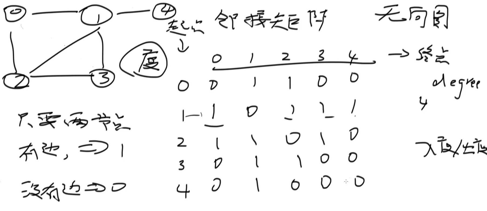
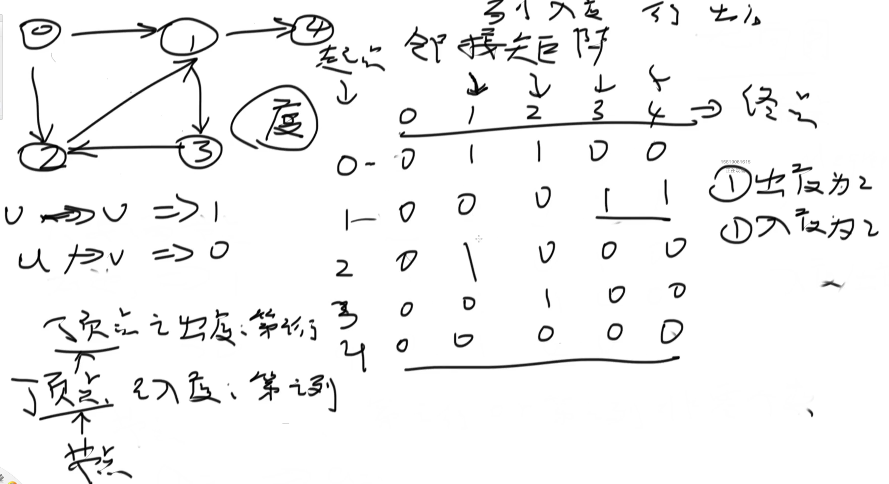
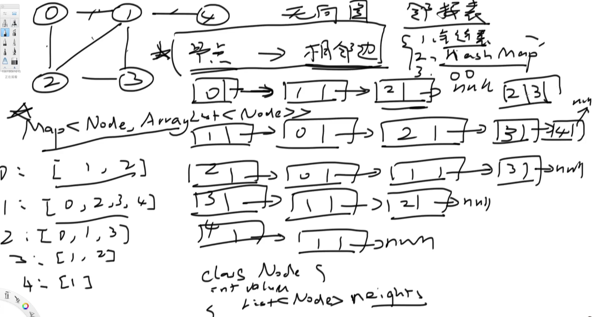
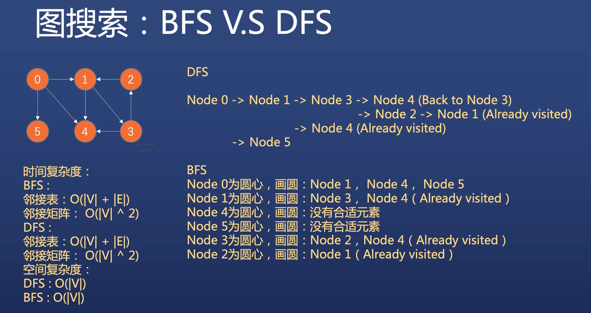

# 1 DFS 深度优先

## 1.1 概述

除了树和一位数组之外，面试中还会考察下列数据结构上的DFS

- 一般图
- 矩阵（二位数组）

【重点】DFS+涂色标记（避免节点重复访问）

【重点】搜索节点如何移动

【重要】同时能用DFS/BFS求解的图或者矩阵问题，请优先考虑BFS


## 1.2 图的基本概念

- 图G(V, E): 由一系列定点（Vertices）和边（Edges）连接而成
- 有向边与有向图
  - 有向边e = （u, v） -> u为边的起始定点，v为边的终止定点
  - 有向图: 有向边组成的图
  - 有向无环图（DAG）: 无法从某个定点出发经过若干条边回到该点的有向图
- 无向图：边不带方向
- 带权图：边带着权重


## 1.3 图的表示

- 邻接矩阵



---



- 邻接表

对某一个节点来说，有几条边和他相接，那么相接后的节点组成了邻接表




## 1.4 图搜索



Time complexity:

BFS: 

- 邻接表：O（节点数 + 边数）
- 邻接矩阵：O（节点数^2）

DFS:

- 邻接表：O（节点数 + 边数）
- 邻接矩阵：O（节点数^2）

Space complexity:

DFS: O(节点数)

BFS: O(节点数)

### 结论

如果题目属于图搜索问题，既能采用DFS，也能采用BFS，优先考虑BFS


## 1.5 图DFS/BFS模板
```java
import java.util.ArrayList;
import java.util.HashMap;
import java.util.List;
import java.util.Map;

// Undirected graph
public class Graph {

    class Node {
        int no;
        int value;

        public Node(int no, int value) {
            this.no = no;
            this.value = value;
        }

        public int getNo() {
            return no;
        }

        public void setNo(int no) {
            this.no = no;
        }

        public int getValue() {
            return value;
        }

        public void setValue(int value) {
            this.value = value;
        }
    }

    // 邻接表  Key: 当前节点   Value： 邻接节点
    private final Map<Node, List<Node>> adjacencyList;

    // 是否被访问涂色过
    private boolean[] marked;

    public Graph(int vertexCount) {
        this.adjacencyList = new HashMap<>();
        this.marked = new boolean[vertexCount];
    }

    public Graph(Map<Node, List<Node>> adjacencyList) {
        this.adjacencyList = adjacencyList;
    }

    public Graph(Map<Node, List<Node>> adjacencyList, boolean[] marked) {
        this.adjacencyList = adjacencyList;
        this.marked = marked;
    }

    // 方法
    // 加节点
    public void addVertex(Node v) {
        this.adjacencyList.put(v, new ArrayList<>());
    }

    // 给两个节点加上边
    public void addEdge(Node u, Node v) {
        this.adjacencyList.get(u).add(v);
        this.adjacencyList.get(v).add(u);
    }

    public void printGraph() {
        for (Node key : adjacencyList.keySet()) {
            List<Node> adjNodes = adjacencyList.get(key);
            System.out.println("key = " + key.getNo() + " adjNodes = " + adjNodes);
        }
    }

    // dfs模板
    public void dfs(Node start) {

        // 标记本节点已经被访问
        marked[start.getNo()] = true;

        // 邻接节点
        for (Node adjNode : adjacencyList.get(start)) {
            if (!marked[adjNode.getNo()]) {
                dfs(adjNode);
            }
        }

    }


    // bfs
    public void bfs() {

    }
}
```

## 1.6 实战

### 无向图中连通分量的数目

323
```java
class Solution {
    public int countComponents(int n, int[][] edges) {
        // count：做了几次DFS
        int count = 0;

        // step 0: 构建邻接表
        Map<Integer, List<Integer>> adj = new HashMap<>();
        for (int i = 0; i < n; i++) {
            adj.put(i, new ArrayList<>());
        }

        // 因为要构造成无向图，所以节点都需要双连
        for (int i = 0; i < edges.length; i++) {
            int u = edges[i][0];
            int v = edges[i][1];
            adj.get(u).add(v);
            adj.get(v).add(u);
        }

        // step 1: 套模板
        boolean[] marked = new boolean[n];
        for (int i = 0; i < n; i++) {
            // 只有没有被标记过，才能进行dfs
            if (!marked[i]) {
                dfs(adj, marked, i);
                count++;
            }
        }
        return count;
    }

    private void dfs(Map<Integer, List<Integer>> adj, boolean[] marked, int nodeNum) {
        // 首先标记节点
        marked[nodeNum] = true;

        // dfs
        for (int node : adj.get(nodeNum)) {
            if (!marked[node]) {
                dfs(adj, marked, node);
            }
        }
    }
}
```
