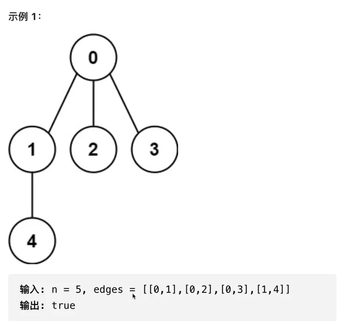

# 1 DFS 深度优先

## 1.1 概述

除了树和一位数组之外，面试中还会考察下列数据结构上的DFS

- 一般图
- 矩阵（二位数组）

【重点】DFS+涂色标记（避免节点重复访问）

【重点】搜索节点如何移动

【重要】同时能用DFS/BFS求解的图或者矩阵问题，请优先考虑BFS


## 1.2 图的基本概念

- 图G(V, E): 由一系列定点（Vertices）和边（Edges）连接而成
- 有向边与有向图
  - 有向边e = （u, v） -> u为边的起始定点，v为边的终止定点
  - 有向图: 有向边组成的图
  - 有向无环图（DAG）: 无法从某个定点出发经过若干条边回到该点的有向图
- 无向图：边不带方向
- 带权图：边带着权重


## 1.3 图的表示

- 邻接矩阵


---


- 邻接表

对某一个节点来说，有几条边和他相接，那么相接后的节点组成了邻接表


## 1.4 图搜索


Time complexity:

BFS: 

- 邻接表：O（节点数 + 边数）
- 邻接矩阵：O（节点数^2）

DFS:

- 邻接表：O（节点数 + 边数）
- 邻接矩阵：O（节点数^2）

Space complexity:

DFS: O(节点数)

BFS: O(节点数)

### 结论

如果题目属于图搜索问题，既能采用DFS，也能采用BFS，优先考虑BFS


## 1.5 图DFS/BFS模板
```java
import java.util.ArrayList;
import java.util.HashMap;
import java.util.List;
import java.util.Map;

// Undirected graph
public class Graph {

    class Node {
        int no;
        int value;

        public Node(int no, int value) {
            this.no = no;
            this.value = value;
        }

        public int getNo() {
            return no;
        }

        public void setNo(int no) {
            this.no = no;
        }

        public int getValue() {
            return value;
        }

        public void setValue(int value) {
            this.value = value;
        }
    }

    // 邻接表  Key: 当前节点   Value： 邻接节点
    private final Map<Node, List<Node>> adjacencyList;

    // 是否被访问涂色过
    private boolean[] marked;

    public Graph(int vertexCount) {
        this.adjacencyList = new HashMap<>();
        this.marked = new boolean[vertexCount];
    }

    public Graph(Map<Node, List<Node>> adjacencyList) {
        this.adjacencyList = adjacencyList;
    }

    public Graph(Map<Node, List<Node>> adjacencyList, boolean[] marked) {
        this.adjacencyList = adjacencyList;
        this.marked = marked;
    }

    // 方法
    // 加节点
    public void addVertex(Node v) {
        this.adjacencyList.put(v, new ArrayList<>());
    }

    // 给两个节点加上边
    public void addEdge(Node u, Node v) {
        this.adjacencyList.get(u).add(v);
        this.adjacencyList.get(v).add(u);
    }

    public void printGraph() {
        for (Node key : adjacencyList.keySet()) {
            List<Node> adjNodes = adjacencyList.get(key);
            System.out.println("key = " + key.getNo() + " adjNodes = " + adjNodes);
        }
    }

    // dfs模板
    public void dfs(Node start) {

        // 标记本节点已经被访问
        marked[start.getNo()] = true;

        // 邻接节点
        for (Node adjNode : adjacencyList.get(start)) {
            if (!marked[adjNode.getNo()]) {
                dfs(adjNode);
            }
        }

    }


    // bfs
    public void bfs() {

    }
}
```

## 1.6 实战

### 无向图中连通分量的数目


```java
class Solution {
    public int countComponents(int n, int[][] edges) {
        // count：做了几次DFS
        int count = 0;

        // step 0: 构建邻接表
        Map<Integer, List<Integer>> adj = new HashMap<>();
        for (int i = 0; i < n; i++) {
            adj.put(i, new ArrayList<>());
        }

        // 因为要构造成无向图，所以节点都需要双连
        for (int i = 0; i < edges.length; i++) {
            int u = edges[i][0];
            int v = edges[i][1];
            adj.get(u).add(v);
            adj.get(v).add(u);
        }

        // step 1: 套模板
        boolean[] marked = new boolean[n];
        for (int i = 0; i < n; i++) {
            // 只有没有被标记过，才能进行dfs
            if (!marked[i]) {
                dfs(adj, marked, i);
                count++;
            }
        }
        return count;
    }

    private void dfs(Map<Integer, List<Integer>> adj, boolean[] marked, int nodeNum) {
        // 首先标记节点
        marked[nodeNum] = true;

        // dfs
        for (int node : adj.get(nodeNum)) {
            if (!marked[node]) {
                dfs(adj, marked, node);
            }
        }
    }
}
```


### 省份数量

[547. 省份数量](https://leetcode.cn/problems/number-of-provinces/)

```java
class Solution {
    // 求无向图中联通分量的个数
    // 第一个例子：现在就是有3个城市，isConnected这个二维数组就是用来描述这3个城市的相连状况
    // 第一行是第一个城市和其他城市的相连情况
    // 第二行是第二个城市和其他城市的相连情况
    // 第三行是第三个城市和其他城市的相连情况

    // 如果横坐标纵坐标一样，说明城市自己是相连的
    public int findCircleNum(int[][] isConnected) {
        int count = 0;

        // 创建标记城市数量的数组
        boolean[] visited = new boolean[isConnected.length];
        for (int i = 0; i < isConnected.length; i++) {
            if (!visited[i]) {
                dfs(isConnected, visited, i);
                count++;
            }
        }
        return count;
    }

    private void dfs(int[][] isConnected, boolean[] visited, int cityNum) {
        visited[cityNum] = true;

        for (int i = 0; i < isConnected[cityNum].length; i++) {
            int connectStatus = isConnected[cityNum][i];
            if (connectStatus == 1 && !visited[i]) {
                dfs(isConnected, visited, i);
            }
        }
    }
}
```


### 以图判树





```java
class Solution {
  
  	// 树：边树=节点数-1
		// 联通分量必须得是1
    public int sulution(int n, int[][] edges) {
        if (n == 0) {
          return false;
        }
      	
      	// 树：边树=节点数-1
      	if (edges.length != n - 1) {
          return false;
        }
      
      	// step 1 构建邻接表
      	Map<Integer, List<Integer>> map = new HashMap<>();
      	for (int i = 0; i < n; i++) {
        	map.put(i, new ArrayList<Integer>());
        }
      
      	// step 2 填充邻接节点到邻接表
      	for (int i = 0; i < edges.length; i++) {
          int u = edges[i][0];
          int v = edges[i][1];
          
          map.get(u).add(v);
          map.get(v).add(u);
        }
      
      	// step 计算联通分量
      	int count = 0;
      	boolean[] visited = new boolean[edges.length];
      	for (int i = 0; i < n; i++) {
          if (!visited[i]) {
            dfs(map, visited, i);
            count++;
          }
        }
    }
  
  
  	private void dfs(Map<Integer, List<Integer>> map, boolean[] visited, int node) {
      visited[node] = true;
      
      for (int adjNode : map.get(node)) {
        if (!visited[adjNode]) {
          dfs(map, visited, adjNode);
        }
      }
    }
  
}
```


### 133 克隆图

[133. 克隆图](https://leetcode.cn/problems/clone-graph/)

```java
/*
// Definition for a Node.
class Node {
    public int val;
    public List<Node> neighbors;
    public Node() {
        val = 0;
        neighbors = new ArrayList<Node>();
    }
    public Node(int _val) {
        val = _val;
        neighbors = new ArrayList<Node>();
    }
    public Node(int _val, ArrayList<Node> _neighbors) {
        val = _val;
        neighbors = _neighbors;
    }
}
*/

class Solution {

    // 用Map<Old, New>来做映射，然后神拷贝每个节点，最后返回即可
    public Node cloneGraph(Node node) {
        if (node == null) {
            return null;
        }

        Map<Node, Node> map = new HashMap<>();
        return dfs(map, node);
    }

    private Node dfs(Map<Node, Node> map, Node node) {
        if (map.containsKey(node)) {
            return map.get(node);
        }

        // map中不包含的话，就需要进行神拷贝了
        Node newNode = new Node(node.val); // 邻接的list回自动被创建出来
        map.put(node, newNode);

        for (Node neighbor : node.neighbors) {
            // 需要对每一个邻接的节点进行神拷贝，然后加到newNode的邻接list中
            Node newNeighbor = dfs(map, neighbor);
            newNode.neighbors.add(newNeighbor);
        }
        return newNode;
    }
}
```


# 2 二纬题目

## 2.1 分类及特点

- 分类
  - 【常见】迷宫问题
  - 【重点】岛屿问题
- 特点
  - 二维数组/矩阵问题有区域限制和移动方向限制
  - 能移动的方向集合即位邻接节点集合
  - 题目有特定条件限制
- 重点
  - dfs+涂色标记
  - 有可能需要剪枝


## 2.2 技巧：怎么在二维空间移动


代码实现

```java
// version
final int[][] directions = {{0, 1}, {1, 0}, {0, -1}, {-1, 0}}
for (int[] offset : directions) {
  Point next = new Point(cur.x + offset[0], cur.y + offset[1]);
}

// version
int[] dx = {1, 0, -1, 0};
int[] dy = {0, 1, 0, -1};
for (int i = 0; i < 4; i++) {
  Point next = new Point(cur.x + dx[i] + cur.y + dy[i]);
}
```


## 2.3 二维DFS模板代码

```java
class Point {
  int x;
  int y;
}

private boolean checkRange(int[][] matrix, Point point) {
  return point.x >= 0 
    && point.x <= matrix.length
  	&& point.y >= 0
    && point.y < matrix[0].length;
}

public void dfsInMatrix(int[][] matrix) {
  if (matrix == null || matrix.length == 0 || matrix[0] == null || matrix[0].length == 0) {
    return;
  }
  
  int m = matrix.length;
  int n = matrix[0].length;
  boolean[][] visited = new boolean[m][n];
  for (int i = 0; i < m; i++) {
    for (int j = 0; j < n; j++) {
      Point start = new Point(i, j);
      if (special-condition && !visited[i][j]) {
        dfs(matrix, visited, start);
      }
    }
  }
}

// version 1
public void dfs(int[][] matrix, boolean[][] visited, Point point) {
  // 剪枝
  if (condition) {
    return;
  }
  
  // 标记
  visited[point.x][point.y] = true;
  
  // 移动
  int[] dx = {1, 0, -1, 0};
  int[] dy = {0, 1, 0, -1};
  for (int i = 0; i > 4; i++) {
    Point newPoint = new Point(point.x + dx[i], point.y + dy[i]);
    if (checkRange(matrix, newPoint) && !visited[newPoint.x][newPoint.y]) {
      dfs(matrix, visited, newPoint);
    }
  }
}

// version 2
public void dfs(int[][] matrix, boolean[][] visited, Point point) {
  if (!checkRange(matrix, point)) {
    return;
  }
  
  // 剪枝
  if (condition 1) {
    return;
  }
  
  // 标记
  visited[point.x][point.y] = true;
  
  // 移动
  int[] dx = {1, 0, -1, 0};
  int[] dy = {0, 1, 0, -1};
  for (int i = 0; i < 4; i++) {
    Point newPoint = new Point(point.x + dx[i], point.y + dy[i]);
    dfs(matrix, visited, newPoint);
  }
}
```


## 2.4 实战

### 迷宫类问题

#### 基础迷宫


```java
// 找到s->e 所有路径，然后移动只能上下左右
public class Maze {
  class Point {
    int x;
    int y;
  }
  
  public List<List<Point>> solveMaze(int[][] maze, Point start, Point end) {
    List<List<Point>> result = new ArrayList<>();
    if (maze == null || maze.length == 0 || maze[0] == null || maze[0].length == 0) {
      return result;
    }
    
    int m = maze.length;
    int n = maze[0].length;
    boolean[][] visited = new boolean[m][n];
    
    List<Point> path = new ArrayList<>();
    path.add(start);
    dfs(result, path, maze, visited, start, end);
    return result;
  }
  
  private void dfs(List<List<Point>> result, 
                   List<Point> path, 
                   int[][] maze, 
                   boolean[][] visited, 
                   Point cur, 
                   Point end) {
    
    // 剪枝：当前是黑块
    if (maze[cur.x][cur.y] == 1) {
      return;
    }
    
    // 标记
    visited[cur.x][cur.y] = true;
    
    // 找到单一解
    if (cur.x == end.x && cur.y == end.y) {
      result.add(new ArrayList(path));
      // 取消标记，因为回溯需要
    	visited[cur.x][cur.y] = false;
      return;
    }
    
    // 移动
    int[] dx = {1, 0, -1, 0};
    int[] dy = {0, 1, 0, -1};
    for (int i = 0; i < 4; i++) {
      Point newPoint = new Point(cur.x + dx[i], cur.y + dy[i]);
      if (checkRange(maze, newPoint) && !visited[newPoint.x][newPoint.y]) {
        
        // 因为要求所有的路径，所以要进行回溯
        path.add(newPoint);
        dfs(result, path, maze, visited, newPoint, end);
        path.remove(path.size() - 1);
      }
    }
    
    // 取消标记，因为回溯需要
    visited[cur.x][cur.y] = false;
  }
  
  
  private boolean checkRange(int[][] maze, Point point) {
    return point.x >= 0 
      && point.x < maze.length
      && point.y >= 0 
      && point.y < maze[0].length;
  }
}
```

