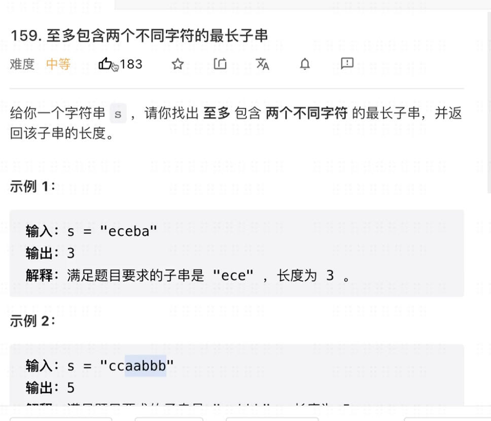

# 1. 双指针

## 1.1 相遇型双指针

### Two Sum类

- 相等型：2 Sum/3 Sum/K Sum
- 不等型：Closet/Smaller/Greater


## 1.2 相遇类指针实战

### 两数之和 II - 输入有序数组

[167. 两数之和 II - 输入有序数组](https://leetcode.cn/problems/two-sum-ii-input-array-is-sorted/)

```java
class Solution {
    public int[] twoSum(int[] numbers, int target) {
        if (numbers == null || numbers.length == 0) {
            return new int[] {-1, -1};
        }

        int start = 0;
        int end = numbers.length - 1;
        while (start < end) {
            int sum = numbers[start] + numbers[end];
            if (target == sum) {
                return new int[] {start + 1, end + 1};
            } else if (sum > target) {
                end--;
            } else {
                start++;
            }
        }
        return new int[] {-1, -1};
    }
}
```


### 三数之和

[15. 三数之和](https://leetcode.cn/problems/3sum/)

```java
class Solution {
    public List<List<Integer>> threeSum(int[] nums) {
        if (nums == null || nums.length == 0) {
            return Collections.emptyList();
        }

        Arrays.sort(nums);
        List<List<Integer>> result = new ArrayList<>();
        for (int i = 0; i < nums.length - 2; i++) {
            if (i > 0 && nums[i] == nums[i - 1]) {
                continue;
            }

            int start = i + 1;
            int end = nums.length - 1;
            while (start < end) {
                int sum = nums[i] + nums[start] + nums[end];
                if (sum == 0) {
                    List<Integer> list = new ArrayList<>();
                    list.add(nums[i]);
                    list.add(nums[start]);
                    list.add(nums[end]);
                    result.add(list);

                    // 去重
                    while (start < end && nums[start] == nums[start + 1]) {
                        start++;
                    }
                    start++;

                    while (start < end && nums[end] == nums[end - 1]) {
                        end--;
                    }
                    end--;
                } else if (sum > 0) {
                    end--;
                } else {
                    start++;
                }
            }
        }
        return result;
    }
}
```


### 最接近的三数之和

[16. 最接近的三数之和](https://leetcode.cn/problems/3sum-closest/)

```java
class Solution {
    public int threeSumClosest(int[] nums, int target) {
        Arrays.sort(nums);

        int result = Integer.MAX_VALUE;
        for (int i = 0; i < nums.length - 2; i++) {
            if (i > 0 && nums[i] == nums[i - 1]) {
                continue;
            }

            int start = i + 1;
            int end = nums.length  -1;
            while (start < end) {
                int sum = nums[i] + nums[start] + nums[end];
                if (sum == target) {
                    return sum;
                }

                if (Math.abs(sum - target) < Math.abs(result - target)) {
                    result = sum;
                }

                if (sum > target) {
                    // 去重
                    while (start < end && nums[end] == nums[end - 1]) {
                        end--;
                    }
                    end--;
                } else {
                    while (start < end && nums[start] == nums[start + 1]) {
                        start++;
                    }
                    start++;
                }
            }
        }
        return result;
    }
}
```


### 有效三角形的个数

[611. 有效三角形的个数](https://leetcode.cn/problems/valid-triangle-number/)

```java
class Solution {
    public int triangleNumber(int[] nums) {
        Arrays.sort(nums);

        int result = 0;
        for (int i = nums.length - 1; i >= 2; i--) {
            int start = 0;
            int end = i - 1;

            while (start < end) {
                int sum = nums[start] + nums[end];
                if (sum > nums[i]) {
                    result += end - start;// 因为已经排序过了，所以start后面的一定都满足条件
                    end--;
                } else {
                    start++;
                }
            }
        }
        return result;
    }
}
```


### 盛最多水的容器

[11. 盛最多水的容器](https://leetcode.cn/problems/container-with-most-water/)

```java
class Solution {
    public int maxArea(int[] height) {
        int left = 0;
        int right = height.length - 1;
        int result = 0;

        while (left < right) {
            int square = Math.min(height[left], height[right]) * (right - left);
            result = Math.max(square, result);

            if (height[left] < height[right]) {
                left++;
            } else {
                right--;
            }
        }
        return result;
    }
}
```


### 接雨水

[42. 接雨水](https://leetcode.cn/problems/trapping-rain-water/)

三重循环

```java
class Solution {
    public int trap(int[] height) {
        // 找到每个点左右两边最大的柱子。计算当前点可以储存多少水的时候，就可以用较小柱子的高度-当前柱子高度
        if (height == null || height.length <= 2) {
            return 0;
        }

        // 每个点左边的最大柱子高度
        int[] left = new int[height.length];
        int max = Integer.MIN_VALUE;
        for (int i = 0; i < height.length; i++) {
            max = Math.max(max, height[i]);
            left[i] = max; // 如果当前柱子是最高的，那么就把当前柱子的高度，赋值给left[i]. 那么在计算的时候，当前的点可以存储的水一定是0
        }

        int[] right = new int[height.length];
        max = Integer.MIN_VALUE;
        for (int i = height.length - 1; i >= 0; i--) {
            max = Math.max(max, height[i]);
            right[i] = max;
        }

        int result = 0;
        for (int i = 0; i < height.length; i++) {
            result += Math.min(left[i], right[i]) - height[i];
        }
        return result;
    }
}
```


双指针

```java
class Solution {
    public int trap(int[] height) {
        if (height == null || height.length <= 2) {
            return 0;
        }

        int result = 0;
        int left = 0;
        int right = height.length - 1;
        int leftMax = height[left];
        int rightMax = height[right];

        // 必须写上等于，因为左右指针相等的时候，相等的这个索引所在的位置，也可能存水
        while (left <= right) {
            // 根据短板的原理，如果leftMax < rightMax，说明左边的存水量是leftMax - height[i]
            if (leftMax < rightMax) {
                leftMax = Math.max(leftMax, height[left]);
                result += leftMax - height[left];
                left++;
            } else {
                rightMax = Math.max(rightMax, height[right]);
                result += rightMax - height[right];
                right--;
            }
        }
        return result;
    }
}
```


## 1.2 同向型双指针

### 滑动窗口模板

```java
public void slidingWindow(int[] nums) {
  // 可能需要map记录窗口内元素
  Map<Integer, Integer> map;
  
  // 同向双指针
  int i = 0;
  int j = 0;
  
  // 外层for循环，内层while循环作为主体
  for (int i = 0; i < nums.length; i++) {
    while (j < nums.length) {
      // 搞清楚窗口扩展条件
      if (condition 1) {
        j++;
        
        // 更新j状态，窗口内数据更新
      } else {
        break;
      }
    }
    
    // 窗口收缩条件
    // 更新i的状态，窗口内数据更新
  }
}
```


### 无重复字符的最长子串

[3. 无重复字符的最长子串](https://leetcode.cn/problems/longest-substring-without-repeating-characters/)

模板解法

```java
class Solution {
    public int lengthOfLongestSubstring(String s) {
        Set<Character> set = new HashSet<>();
        int i = 0;
        int j = 0;
        int result = 0;

        for (i = 0; i < s.length(); i++) {
            while (j < s.length()) {
                char ch = s.charAt(j);
                if (!set.contains(ch)) {
                    set.add(ch);
                    result = Math.max(result, j - i + 1);
                    j++;
                } else {
                    break;
                }
            }

            set.remove(s.charAt(i));
        }
        return result;
    }
}
```

解法2

```java
class Solution {
    public int lengthOfLongestSubstring(String s) {
        int[] arr = new int[256];
        int i = 0;
        int j = 0;
        int result = 0;

        for (i = 0; i < s.length(); i++) {
            while (j < s.length()) {
                char ch = s.charAt(j);
                if (arr[ch] == 0) {
                    arr[ch] = 1;
                    result = Math.max(result, j - i + 1);
                    j++;
                } else {
                    break;
                }
            }

            arr[s.charAt(i)] = 0;
        }
        return result;
    }
}
```


### 至多包含两个不同字符的最长子串



```java
class Slution {
    public int lengthOfLongestSusstringTwoDistinct(String s) {
        if (s == null || s.length() == 0) {
            return 0;
        }

        int i = 0;
        int j = 0;
        int result = 0;

        // key: 字符  value：字符最后一次出现的位置
        Map<Character, Integer> map = new HashMap<>();

        for (i = 0; i < s.length(); i++) {
            while (j < s.length()) {

                char ch = s.charAt(j);
                if (map.size() <= 2) {
                    map.put(ch, j);
                    result = Math.max(result, j - i + 1);
                    j++;
                } else {
                    break;
                }
            }

            // 收缩左边界到最小的字符最后一次出现的位置
            int minIndex = s.length() - 1;
            for (int index : map.values()) {
                minIndex = Math.min(minIndex, index);
            }
            char charToDelete = s.charAt(minIndex);
            map.remove(charToDelete);
            i = minIndex;
        }
    }
}

```


### 最小覆盖子串

[76. 最小覆盖子串](https://leetcode.cn/problems/minimum-window-substring/)

```java
class Solution {
    public String minWindow(String s, String t) {
        if (s == null || s.length() == 0 || t == null || t.length() == 0) {
            return "";
        }

        // 统计t中字符的数量
        int[] hash = new int[128];
        for (int i = 0; i < t.length(); i++) {
            hash[t.charAt(i)] += 1;
        }

        // 双指针
        int i = 0;
        int j = 0;
        int minLength = Integer.MAX_VALUE;
        String result = "";

        for (i = 0; i < s.length(); i++) {
            while (j < s.length()) {
                if (!findAll(hash)) {
                    // 这里先对hash进行-1操作，那么j++了以后，j+完之后的字符要等到下一轮循环才能被判断，所以加入要找abc在abcd中
                    // 那么找到abc的时候，j指针现在应该指向的是d
                    hash[s.charAt(j)]--;
                    j++;
                } else {
                    break;
                }
            }

            // 由于j现在多移动了一个位置，所以可以直接j - i求出来子字符串的长度
            if (findAll(hash) && j - i < minLength) {
                minLength = j - i;
                result = s.substring(i, j);
            }

            // 移动左边界的值
            hash[s.charAt(i)]++;
        }
        return result;
    }

    private boolean findAll(int[] hash) {
        for (int i = 0; i < hash.length; i++) {
            if (hash[i] > 0) {
                return false;
            }
        }
        return true;
    }
}

```

